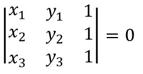

## MaxPointsonaLine


### 思路

特殊情况考虑

- 重合的点 
  ```
  [[1,1],[1,1],[2,3]] =》 3 
  [[1,1],[1,1],[2,3]] =》 2 
  ```

- 溢出的情况 

  ```
  int i = 65535;
  System.out.println(i*i);
  -131071
  ```

tips 

三点共线 线性代数



```
(x1 * y2 + x2 * y3 + x3 * y1 - x3 * y2 - x2 * y1 - x1 * y3 == 0)
```


### GCD

https://leetcode.com/problems/max-points-on-a-line/discuss/47113/A-java-solution-with-notes


