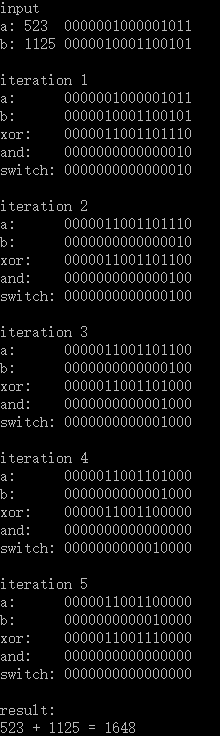

## 371. Sum of Two Integers

tags: 

- leetcode 
- leetcode-leetcode.easy
- leetcode.add


#### 描述

Calculate the sum of two integers *a* and *b*, but you are **not allowed** to use the operator `+` and `-`.

**Example 1:**

```
Input: a = 1, b = 2
Output: 3
```

**Example 2:**

```
Input: a = -2, b = 3
Output: 1
```


####  中文描述

两个数相加，不用+号。


#### 思路

举个简单的例子：997+24

我们平时计算时是将对应位相加和进位同时计算，其实可以保留下进位，只计算对应位相加，保留进位的位置（值）。接下来，将进位向左移动一位，将上一步的结果与移位后的进位值进行对应位相加，直到没有进位结束。

 对于二进制数的而言，对应位相加就可以使用异或（xor）操作，计算进位就可以使用与（and）操作，在下一步进行对应位相加前，对进位数使用移位操作（<<）1


