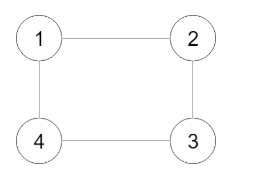

## CloneGraph

Given a reference of a node in a connected undirected leetcode.graph, 
return a deep copy (clone) of the leetcode.graph. Each node in the leetcode.graph contains a val (int) and a list (List[Node]) of its neighbors.

Example:

Input:

{"$id":"1","neighbors":[{"$id":"2","neighbors":[{"$ref":"1"},{"$id":"3","neighbors":[{"$ref":"2"},{"$id":"4","neighbors":[{"$ref":"3"},{"$ref":"1"}],"val":4}],"val":3}],"val":2},{"$ref":"4"}],"val":1}

Explanation:

Node 1's value is 1, and it has two neighbors: Node 2 and 4.

Node 2's value is 2, and it has two neighbors: Node 1 and 3.

Node 3's value is 3, and it has two neighbors: Node 2 and 4.

Node 4's value is 4, and it has two neighbors: Node 1 and 3.

HashMap镜像影分身