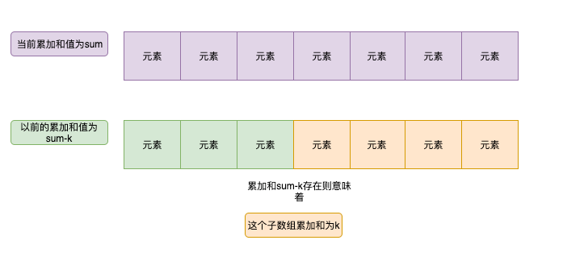

## SubarraySumEqualsK

560. Subarray Sum Equals K

Given an array of integers and an integer k, you need to find the total number of continuous subarrays whose sum equals to k.

Example 1:

Input:nums = [1,1,1], k = 2

Output: 2

Note:

The length of the array is in range [1, 20,000].

The range of numbers in the array is [-1000, 1000] and the range of the integer k is [-1e7, 1e7].

连续子数组的和等于K

### 暴力破解

遍历子数组起始位置 for i = 0 -> n-1 

从每个起始位置，一个一个累加，比较每个累加和k是否相等和直到结尾。

这样就覆盖了所有的子数组。

### HashMap索引

这种方法十分巧妙

计算所有累加和的过程中，看累加和(sum - k)
是否存在，如果存在。则意味着找到了一个结果。

