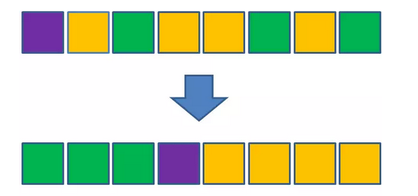
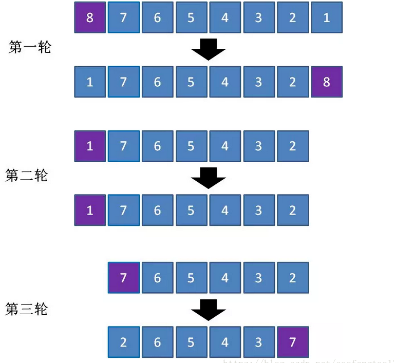

# 快速排序

## 思想

类似冒泡排序,这是快排也是一种交换排序,通过元素间的比较和交换达到目的

冒泡排序在每一轮把一个元素移动到数组的一端,快速排序在每一轮挑选基准元素(pivot).

比它大的放一边,比它小的放一边.这样把数组拆成两个部分,然后再分别处理这两个部分.也就是分治法.




小灰漫画系列,这个讲的挺清楚的

## 特点

基于交换的排序,不稳定(https://www.zhihu.com/question/45929062)

时间复杂度：平均：O(nlogn)、最坏：O(n^2)、最优：O(nlogn)。
空间复杂度：最坏：根据具体的实现方式，一般为O(logn),最优：O(1)。

## 实现

```java
 /**
     * 非递归版本
     *
     * @param arr
     * @param start
     * @param end
     */
    public static void quickSortNoRecursion(int[] arr, int start, int end) {
        Stack<int[]> stack = new Stack<>();
        stack.push(new int[]{start, end});
        while (!stack.isEmpty()) {
            int[] index = stack.pop();
            int pivotIndex = partition(arr, index[0], index[1]);

            // 这里两个条件判断
            if (index[0] < pivotIndex - 1) {
                stack.push(new int[]{index[0], pivotIndex - 1});
            }
            if (pivotIndex + 1 < index[1]) {
                stack.push(new int[]{pivotIndex + 1, index[1]});
            }
        }


    }

    /**
     * 递归版本
     *
     * @param arr
     * @param start
     * @param end
     */
    public static void quickSort(int[] arr, int start, int end) {
        if (start >= end) {
            return;
        }
        int pivotIndex = partition(arr, start, end);
        quickSort(arr, start, pivotIndex - 1);
        quickSort(arr, pivotIndex + 1, end);
    }

    /**
     * 单边循环法
     *
     * @param arr
     * @param start
     * @param end
     * @return
     */
    public static int partition(int[] arr, int start, int end) {

        int mark = start;
        int pivot = arr[start];
        for (int i = start + 1; i <= end; i++) {
            if (arr[i] < pivot) {
                mark++;
                int temp = arr[i];
                arr[i] = arr[mark];
                arr[mark] = temp;
            }
        }

        arr[start] = arr[mark];
        arr[mark] = pivot;
        return mark;


    }

    public static void main(String[] args) {
        int[] arr = new int[]{4, 3, 7, 5, 6, 2, 8, 1};
        quickSort(arr, 0, 7);
        System.out.println();
    }
```


## 性能关键的问题

### 已有序
1. 已排序

2. 数值全部相等（1的特殊情况）

   完全逆序举例



性能退化为O(n2)

## 优化

### 基准元素的选择

三数字取中法

```java
/**
     * 通过三值取中(从arr[low...high]子序列中)获取枢轴pivot的值，让arr[low]变成中值;并返回计算的枢轴(pivot)
     */
    private int medianOfThree(int[] arr, int low, int high) {
        int mid = low + ((high - low) >> 1); // mid = low + (high-low)/2, 中间元素下标

        // 使用三值取中得到枢轴
        if (arr[low] > arr[high]) { // 目的：让arr[low] <= arr[high]
            swap(arr, low, high);
        }
        if (arr[mid] > arr[high]) { // 目的：让arr[mid] <= arr[high]
            swap(arr, mid, high);
        }
        if (arr[mid] > arr[low]) { // 目的： 让arr[low] >= arr[mid]
            swap(arr, low, mid);
        }
        // 经过上述变化，最终 arr[mid]<=arr[low]<=arr[high]，则arr[low]为中间值
        return arr[low];
    }
```


随机选择可能在一定程度上避免性能的退化


### 小数组情况

数组长度小于一定数值时候使用插入排序(应该没什么比它更快了)


### 大量重复数字情况

见双轴快排/三向切分快排


### 非递归实现


### 其他tips

加快swap的方式

```java
if(a == b) return;
a = a ^ b
b = a ^ b
a = a ^ b 
-----------------------------
a = a + b;
b = a - b;
a = a - b;

```


## 快速排序与归并排序的对比

从某种程度来讲,归并排序和快速排序是相反的,
快速排序是先以一个分界,处理好整体,然后再分别治理两边的局部部分.
归并是先向下治理好局部,然后一层一层合并到整体.


## 参考

https://www.jianshu.com/p/bc62a66be82c

https://juejin.im/post/5b55660ee51d4519202e2003

https://www.cnblogs.com/kira2will/p/3976538.html

https://www.cnblogs.com/kira2will/p/3976538.html