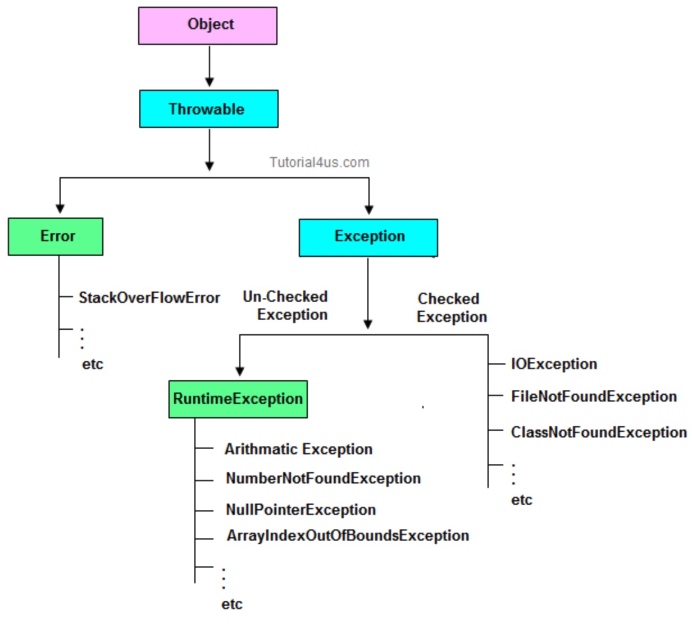

# Java异常


## 体系




## 常见异常

### NoClassDefFoundError和ClassNotFoundException

NoClassDefFoundError是一个错误(Error)，而ClassNOtFoundException是一个异常，在Java中对于错误和异常的处理是不同的，我们可以从异常中恢复程序但却不应该尝试从错误中恢复程序。

- ClassNotFoundException的产生原因：

  Java支持使用Class.forName方法来动态地加载类，任意一个类的类名如果被作为参数传递给这个方法都将导致该类被加载到JVM内存中，如果这个类在类路径中没有被找到，那么此时就会在运行时抛出ClassNotFoundException异常。

  解决该问题需要确保所需的类连同它依赖的包存在于类路径中，常见问题在于类名书写错误。
  另外还有一个导致ClassNotFoundException的原因就是：当一个类已经某个类加载器加载到内存中了，此时另一个类加载器又尝试着动态地从同一个包中加载这个类。通过控制动态类加载过程，可以避免上述情况发生。
  
  
  
- NoClassDefFoundError产生的原因:
    如果JVM或者ClassLoader实例尝试加载（可以通过正常的方法调用，也可能是使用new来创建新的对象）类的时候却找不到类的定义。要查找的类在编译的时候是存在的，运行的时候却找不到了。这个时候就会导致NoClassDefFoundError.
    造成该问题的原因可能是打包过程漏掉了部分类，或者jar包出现损坏或者篡改。解决这个问题的办法是查找那些在开发期间存在于类路径下但在运行期间却不在类路径下的类


## 异常处理的原则

### 尽力不捕获通用异常

尽量不要捕获类似Exception这样的通用异常，而是应该捕获特定异常

这是因为在日常的开发和合作中，我们读代码的机会往往超过写代码，软件工程是门协作的艺术，所以我们有义务让自己的代码能够直观地体现出尽量多的信息，而泛泛的Exception之类，恰恰隐藏了我们的目的。另外，我们也要保证程序不会捕获到我们不希望捕获的异常。比如，你可能更希望RuntimeException被扩散出来，而不是被捕获。

### 不要生吞（swallow）异常

- 不要忽略异常

  把异常抛出来，或者输出到日志（Logger）之类,不要忽略.

- 小心异常覆盖

  一个函数尽管抛出了多个异常，但是只有一个异常可被传播到调用端。最后被抛出的异常是唯一被调用端接收的异常，其他异常都会被吞没掩盖。如果调用端要知道造成失败的最初原因，程序之中就绝不能掩盖任何异常。


### Throw early, catch late

错误的例子

```java
public void readPreferences(String fileName){
	 //...perform operations... 
	InputStream in = new FileInputStream(fileName);
	 //...read the preferences file...
}
```

如果fileName是null，那么程序就会抛出NullPointerException，但是由于没有第一时间暴露出问题，堆栈信息可能非常令人费解，往往需要相对复杂的定位。这个NPE只是作为例子，实际产品代码中，可能是各种情况，比如获取配置失败之类的。在发现问题的时候，第一时间抛出，能够更加清晰地反映问题。

```java
public void readPreferences(String filename) {
	Objects.requireNonNull(filename);
	//...perform other operations... 
	InputStream in = new FileInputStream(filename);
	 //...read the preferences file...
}
```

至于“catch late”，其实是我们经常苦恼的问题，捕获异常后，需要怎么处理呢？最差的处理方式，就是我前面提到的“生吞异常”，本质上其实是掩盖问题。如果实在不知道如何处理，可以选择保留原有异常的cause信息，直接再抛出或者构建新的异常抛出去。在更高层面，因为有了清晰的（业务）逻辑，往往会更清楚合适的处理方式是什么。


## 自定义异常

- 是否需要定义成Checked Exception，因为这种类型设计的初衷更是为了从异常情况恢复，作为异常设计者，我们往往有充足信息进行分类。
- 在保证诊断信息足够的同时，也要考虑避免包含敏感信息，因为那样可能导致潜在的安全问题。如果我们看Java的标准类库，你可能注意到类似java.net.ConnectException，出错信息是类似“ Connection refused (Connection refused)”，而不包含具体的机器名、IP、端口等，一个重要考量就是信息安全。类似的情况在日志中也有，比如，用户数据一般是不可以输出到日志里面的


## 异常的代价

### 额外的性能开销

try-catch代码段会产生额外的性能开销，或者换个角度说，它往往会影响JVM对代码进行优化，所以建议仅捕获有必要的代码段，尽量不要一个大的try包住整段的代码；与此同时，利用异常控制代码流程，也不是一个好主意，远比我们通常意义上的条件语句（if/else、switch）要低效。

### 栈快照

Java每实例化一个Exception，都会对当时的栈进行快照，这是一个相对比较重的操作。如果发生的非常频繁，这个开销可就不能被忽略了。


## try catch finally 和 return，break，continue

- 请勿在try代码块中调用return、break或continue语句。万一无法避免，一定要确保finally的存在不会改变函数的返回值。

- 不要在finally代码块中处理返回值。
- 当遇到return语句的时候，执行函数会立刻返回。但是，在Java语言中，如果存在finally就会有例外。除了return语句，try代码块中的break或continue语句也可能使控制权进入finally代码块。


## 异常处理新特性

### try with resource

```java
try (BufferedReader br = new BufferedReader(…);
     BufferedWriter writer = new BufferedWriter(…)) {// Try-with-resources
   // do something
catch ( IOException | XEception e) {// Multiple catch
   // Handle it
} 
```


## 实际中的异常处理技巧

#### 反应式编程的挑战

现在非常火热的反应式编程（Reactive Stream），因为其本身是异步、基于事件机制的，所以出现异常情况，决不能简单抛出去；另外，由于代码堆栈不再是同步调用那种垂直的结构，这里的异常处理和日志需要更加小心，我们看到的往往是特定executor的堆栈，而不是业务方法调用关系。对于这种情况，你有什么好的办法吗？

类似第二点，我个人也觉得可以泛化为异步编程的概念，比如Future Stage之类使用ExecutionException的思路

业务功能模块分配ID，在记录日志是将前后模块的ID进行调用关系的串联，一并跟任务信息，进行日志保存。

### 如何捕获全局异常

全局异常Spring MVC的方式就很实用


## 异常的底层实现细节

创建Throwable因为要调用native方法fillInStacktrace；至于try catch finally，jvms第三章有细节，也可以自己写一段程序，用javap反编译看看 goto、异常表等等


