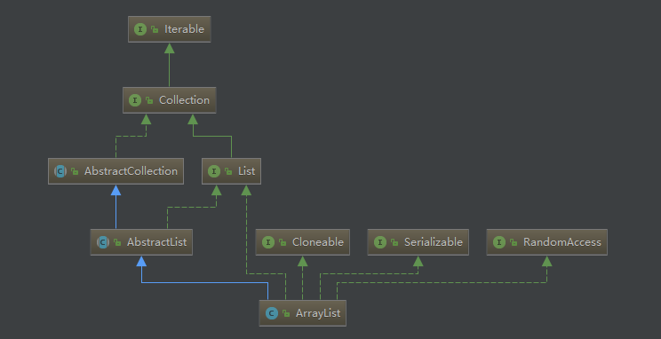

## ArrayList 源码阅读



``` java
public class ArrayList<E> extends AbstractList<E>
        implements List<E>, RandomAccess, Cloneable, java.io.Serializable
```
### Tips
标记接口RandomAccess,代表可以被随机访问。

PECS法则
< ? extends E > 
add： 不允许加入 任何 元素！
get： 可以获取元素，但是必须使用 E 来接受元素！
< ? super E > 
add: 允许添加 E和E的子类 元素！
get: 可以获取元素，但是类的信息丢失了，所以返回只能使用Object引用来接受！如果需要自己的类型需要强制类型转换！


### 属性值
```j ava
    /**默认初始容量
     * Default initial capacity.
     */
    private static final int DEFAULT_CAPACITY = 10;

    /**指定容量或传入collections的构造函数里的空数组
     * Shared empty array instance used for empty instances.
     */
    private static final Object[] EMPTY_ELEMENTDATA = {};

    /**默认构造函数里的空数组
     * Shared empty array instance used for default sized empty instances. We
     * distinguish this from EMPTY_ELEMENTDATA to know how much to inflate(扩容) when
     * first element is added.
     */
    private static final Object[] DEFAULTCAPACITY_EMPTY_ELEMENTDATA = {};

    /**
     * The array buffer into which the elements of the ArrayList are stored.
     * The capacity of the ArrayList is the length of this array buffer. Any
     * empty ArrayList with elementData == DEFAULTCAPACITY_EMPTY_ELEMENTDATA
     * will be expanded to DEFAULT_CAPACITY when the first element is added.
     */
    transient Object[] elementData; // non-private to simplify nested class access

    /**元素数量
     * The size of the ArrayList (the number of elements it contains).
     *
     * @serial
     */
    private int size;
```


### 构造函数
``` java
     /**
     * Constructs an empty list with the specified initial capacity.
     *
     * @param  initialCapacity  the initial capacity of the list
     * @throws IllegalArgumentException if the specified initial capacity
     *         is negative
     */
    public ArrayList(int initialCapacity) {
        if (initialCapacity > 0) {
            this.elementData = new Object[initialCapacity];
        } else if (initialCapacity == 0) {
            // 使用同一个静态空数组
            this.elementData = EMPTY_ELEMENTDATA;
        } else {
            throw new IllegalArgumentException("Illegal Capacity: "+
                                               initialCapacity);
        }
    }
    
    
     /**
     * Constructs a list containing the elements of the specified
     * collection, in the order they are returned by the collection's
     * iterator.
     *
     * @param c the collection whose elements are to be placed into this list
     * @throws NullPointerException if the specified collection is null
     */
    public ArrayList(Collection<? extends E> c) {
        elementData = c.toArray(); // 这里不一定返回object[] 可能是底层的数据类型
        if ((size = elementData.length) != 0) {
            // c.toArray might (incorrectly) not return Object[] (see 6260652)
            if (elementData.getClass() != Object[].class)
                elementData = Arrays.copyOf(elementData, size, Object[].class);
        } else {
            // replace with empty array.
            this.elementData = EMPTY_ELEMENTDATA;
        }
    }    
    
    
    /**
     * Constructs an empty list with an initial capacity of ten.
     */
    public ArrayList() {
        this.elementData = DEFAULTCAPACITY_EMPTY_ELEMENTDATA;
    }

```


### 为什么ArrayList的elementData是用transient修饰的？
transient修饰的属性意味着不会被序列化，也就是说在序列化ArrayList的时候，不序列化elementData。
为什么要这么做呢？

elementData不总是满的，每次都序列化，会浪费时间和空间
重写了writeObject  保证序列化的时候虽然不序列化全部 但是有的元素都序列化

所以说不是不序列化 而是不全部序列化。
``` java

private void writeObject(java.io.ObjectOutputStream s)
        throws java.io.IOException{
     // Write out element count, and any hidden stuff
     int expectedModCount = modCount;
     s.defaultWriteObject();
     // Write out array length
     s.writeInt(elementData.length);
     // Write out all elements in the proper order.
     for (int i=0; i<size; i++)
           s.writeObject(elementData[i]);
    if (modCount != expectedModCount) {
           throw new ConcurrentModificationException();
    }
}


```


参考
https://juejin.im/post/5a58aa62f265da3e4d72a51b
https://blog.csdn.net/fighterandknight/article/details/61240861
https://blog.csdn.net/zxt0601/article/details/77281231
https://blog.csdn.net/fighterandknight/article/details/61240861
http://www.importnew.com/19867.html
