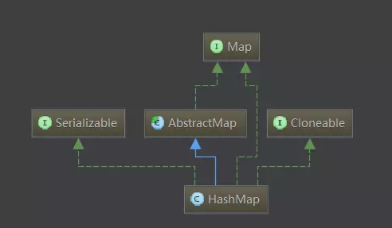
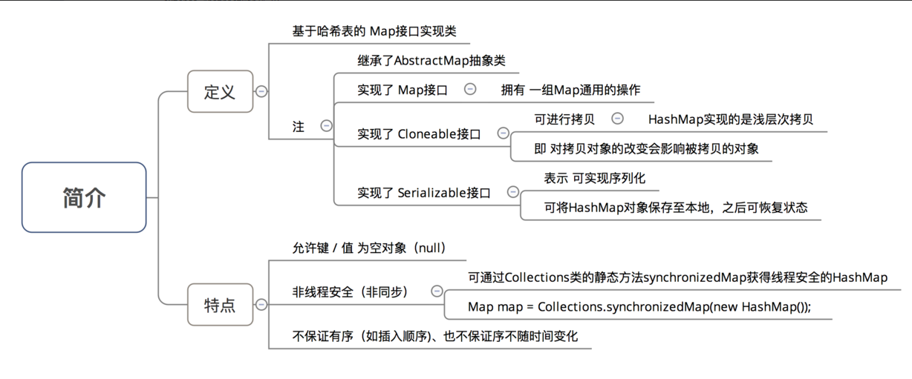
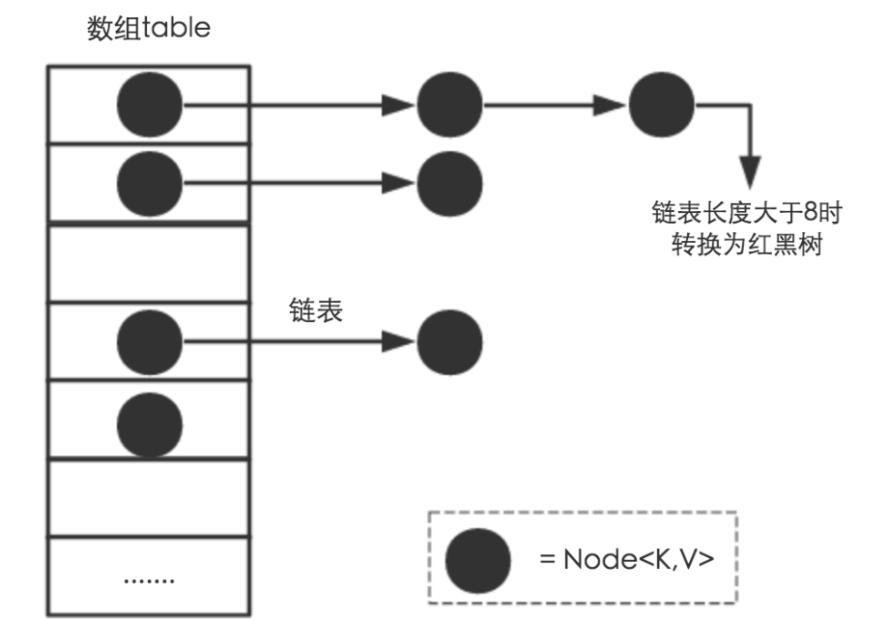

## HashMap 源码阅读






### tips
X % 2^n = X & (2^n - 1)

推理:
```
a % b = a - (a/b)*b 

           = a - (a/2^n) * 2^n
           
           = a - (a >> n) << n
           
           = 在右移中被抛弃的低位(左移补的是0，补不回来)
```

在右移中被抛弃的低位 = a & (2^n - 1)            


###1.7 hashmap
- 数组+链表 
- 冲突使用拉链法


### 属性值
```
    /**
     *  初始容量
     *  The default initial capacity - MUST be a power of two.
     */
    static final int DEFAULT_INITIAL_CAPACITY = 1 << 4; // aka 16
    /**
     * 最大容量
     * The maximum capacity, used if a higher value is implicitly specified
     * by either of the constructors with arguments.
     * MUST be a power of two <= 1<<30.
     */
    static final int MAXIMUM_CAPACITY = 1 << 30;
    /**
     * 默认加载因子
     * The load factor used when none specified in constructor.
     */
    static final float DEFAULT_LOAD_FACTOR = 0.75f;
   
    static final int TREEIFY_THRESHOLD = 8;         // 链表转换红黑树的阈值
    static final int UNTREEIFY_THRESHOLD = 6;       // 红黑树转换为链表的阈值
    static final int MIN_TREEIFY_CAPACITY = 64;     // 红黑树结构的最小容量
    transient HashMap.Node<K, V>[] table;
    transient Set<Entry<K, V>> entrySet;
    transient int size;
    transient int modCount;//修改次数
    int threshold;// HashMap的阈值，用于判断是否需要调整HashMap的容量（threshold = 容量*加载因子） 
    
    // 加载因子
    final float loadFactor;
   
```

### 链表节点Node<K,V>
``` java
    /**
     * Basic hash bin node, used for most entries.  (See below for
     * TreeNode subclass, and in LinkedHashMap for its Entry subclass.)
     */
    static class Node<K,V> implements Map.Entry<K,V> {
        final int hash;
        final K key;
        V value;
        Node<K,V> next;

        Node(int hash, K key, V value, Node<K,V> next) {
            this.hash = hash;
            this.key = key;
            this.value = value;
            this.next = next;
        }

        public final K getKey()        { return key; }
        public final V getValue()      { return value; }
        public final String toString() { return key + "=" + value; }

        public final int hashCode() {
            return Objects.hashCode(key) ^ Objects.hashCode(value);
        }

        public final V setValue(V newValue) {
            V oldValue = value;
            value = newValue;
            return oldValue;
        }

        public final boolean equals(Object o) {
            if (o == this)
                return true;
            if (o instanceof Map.Entry) {
                Map.Entry<?,?> e = (Map.Entry<?,?>)o;
                if (Objects.equals(key, e.getKey()) &&
                    Objects.equals(value, e.getValue()))
                    return true;
            }
            return false;
        }
    }
```


### HashMap的hash方法
``` java
    static final int hash(Object key) {
        int h;
        // 让高16位也参与运算
        return (key == null) ? 0 : (h = key.hashCode()) ^ (h >>> 16);
    }
    public V put(K key, V value) {
        return putVal(hash(key), key, value, false, true);
    }
```


### HashMap计算容量的方法
先来分析有关n位操作部分：先来假设n的二进制为01xxx...xxx。接着

对n右移1位：001xx...xxx，再位或：011xx...xxx

对n右移2位：00011...xxx，再位或：01111...xxx

对n右移4位：00011...xxx，再位或：011111111...xxx

对n右移8位：00011...xxx，再位或：01111111111111111...xxx

综上可得，该算法让最高位的1后面的位全变为1。

最后再让结果n+1，即得到了2的整数次幂的值了。

现在回来看看第一条语句：

int n = cap - 1;
让cap-1再赋值给n的目的是另找到的目标值大于或等于原值。例如二进制1000，十进制数值为8。如果不对它减1而直接操作，将得到答案10000，即16。显然不是结果。减1后二进制为111，再进行操作则会得到原来的数值1000，即8。

``` java
    /**
     * Returns a power of two size for the given target capacity.
     */
    static final int tableSizeFor(int cap) {
        int n = cap - 1;
        n |= n >>> 1;
        n |= n >>> 2;
        n |= n >>> 4;
        n |= n >>> 8;
        n |= n >>> 16;
        return (n < 0) ? 1 : (n >= MAXIMUM_CAPACITY) ? MAXIMUM_CAPACITY : n + 1;
    }

```

### put 方法
``` java
public V put(K key, V value) {
        return putVal(hash(key), key, value, false, true);
}

final V putVal(int hash, K key, V value, boolean onlyIfAbsent,
                   boolean evict) {
        Node<K,V>[] tab; Node<K,V> p; int n, i;
         // tab为空则调用resize()初始化创建
        if ((tab = table) == null || (n = tab.length) == 0)         
            n = (tab = resize()).length;
        // 计算index,并对null做处理  
        if ((p = tab[i = (n - 1) & hash]) == null)// 无哈希冲突,创建新的Node
            tab[i] = newNode(hash, key, value, null);
        else {
            Node<K,V> e; K k;
            // 节点key存在,直接覆盖value，保证key的唯一性
            if (p.hash == hash &&
                ((k = p.key) == key || (key != null && key.equals(k))))
                e = p;
            // 判断是否为为红黑树    
            else if (p instanceof TreeNode)
                e = ((TreeNode<K,V>)p).putTreeVal(this, tab, hash, key, value);//是红黑树，赋值 
            else {  //是链表
                // index 相同的情况下
                for (int binCount = 0; ; ++binCount) {
                    if ((e = p.next) == null) {
                        p.next = newNode(hash, key, value, null); //如果e后的Node为空，将value赋予下一个Node
                        if (binCount >= TREEIFY_THRESHOLD - 1) // -1 for 1st
                            treeifyBin(tab, hash);//链表长度达到8，改变链表结构为红黑树
                        break;
                    }
                    // key相同则跳出循环
                    if (e.hash == hash &&
                        ((k = e.key) == key || (key != null && key.equals(k))))
                        break;
                    //就是移动指针方便继续取 p.next
                    p = e;
                }
            }
            if (e != null) { 
                V oldValue = e.value;
                //根据规则选择是否覆盖value
                if (!onlyIfAbsent || oldValue == null)
                    e.value = value;
                afterNodeAccess(e);
                return oldValue;
            }
        }
        ++modCount;
        // 扩容检测
        if (++size > threshold)
            // size大于加载因子,扩容
            resize();
        afterNodeInsertion(evict);
        return null;
    }

```

### remove方法
``` java
     /**
     * Implements Map.remove and related methods
     *
     * @param hash hash for key
     * @param key the key
     * @param value the value to match if matchValue, else ignored
     * @param matchValue if true only remove if value is equal
     * @param movable if false do not move other nodes while removing
     * @return the node, or null if none
     */
    final Node<K,V> removeNode(int hash, Object key, Object value,
                               boolean matchValue, boolean movable) {
        Node<K,V>[] tab; Node<K,V> p; int n, index;
        // 链表不为null 且 length > 0 且 table[index]上有值
        if ((tab = table) != null && (n = tab.length) > 0 &&
            (p = tab[index = (n - 1) & hash]) != null) {
            
            Node<K,V> node = null, e; K k; V v;
            if (p.hash == hash &&
                ((k = p.key) == key || (key != null && key.equals(k))))
                // 直接找到了这个节点
                node = p;
            else if ((e = p.next) != null) {
                if (p instanceof TreeNode)
                    // 红黑树节点
                    node = ((TreeNode<K,V>)p).getTreeNode(hash, key);
                else {
                    // 链表节点
                    do {
                        if (e.hash == hash &&
                            ((k = e.key) == key ||
                             (key != null && key.equals(k)))) {
                            node = e;
                            break;
                        }
                        p = e;
                    } while ((e = e.next) != null);
                }
            }
            // 获取到node后，分情形删除节点
            if (node != null && (!matchValue || (v = node.value) == value ||
                                 (value != null && value.equals(v)))) {
                if (node instanceof TreeNode)
                    // 这里我们只需要知道我们只是删除对应的红黑树节点即可
                    ((TreeNode<K,V>)node).removeTreeNode(this, tab, movable);
                else if (node == p)
                    // table[index]的entry变成下一个
                    tab[index] = node.next;
                else
                    // 链表删除
                    p.next = node.next;
                ++modCount;
                --size;
                afterNodeRemoval(node);
                return node;
            }
        }
        return null;
    }


```


### HashMap并发导致的死锁
https://coolshell.cn/articles/9606.html


### 1.8的新特性
数组+链表+红黑树



hash方法变成了向右移动16位

resize()方法 计算扩容后位置无需每个都计算。且使用尾插入法(1.7是头插入法)，不会出现逆序，环形链表死循环问题


参考：
https://juejin.im/post/5aa5d8d26fb9a028d2079264
https://www.jianshu.com/p/df4a907ef4ef
https://blog.csdn.net/yang_yulei/article/details/26066409
https://blog.csdn.net/mq2553299/article/details/76858495
https://www.cnblogs.com/ayanami-rei/p/5998097.html
