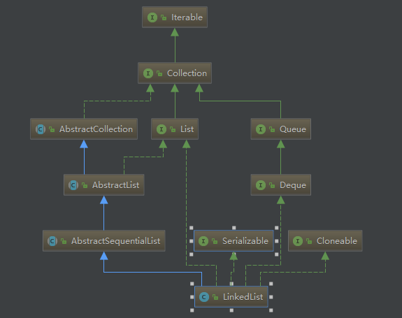

## LinkedList 源码阅读



``` java
public class LinkedList<E>
    extends AbstractSequentialList<E>  //顺序
    implements List<E>, Deque<E>, Cloneable, java.io.Serializable
```
LinkedList 是一个继承于AbstractSequentialList的双向循环链表。它也可以被当作堆栈、队列或双端队列进行操作。
LinkedList 实现 List 接口，能对它进行队列操作。
LinkedList 实现 Deque 接口，即能将LinkedList当作双端队列使用。
LinkedList 实现了Cloneable接口，即覆盖了函数clone()，能克隆。
LinkedList 实现java.io.Serializable接口，这意味着LinkedList支持序列化，能通过序列化去传输。
LinkedList 是非同步的。


### 属性

``` java
    transient int size = 0;

    /**
     * Pointer to first node.
     * Invariant: (first == null && last == null) ||
     *            (first.prev == null && first.item != null)
     */
    transient Node<E> first;

    /**
     * Pointer to last node.
     * Invariant: (first == null && last == null) ||
     *            (last.next == null && last.item != null)
     */
    transient Node<E> last;
```

### Node<E> 节点
``` java
    private static class Node<E> {
        E item;
        Node<E> next;
        Node<E> prev;

        Node(Node<E> prev, E element, Node<E> next) {
            this.item = element;
            this.next = next;
            this.prev = prev;
        }
    }

```

### 构造方法
``` java
    /**
     * Constructs an empty list.
     */
    public LinkedList() {
    }

    /**
     * Constructs a list containing the elements of the specified
     * collection, in the order they are returned by the collection's
     * iterator.
     *
     * @param  c the collection whose elements are to be placed into this list
     * @throws NullPointerException if the specified collection is null
     */
    public LinkedList(Collection<? extends E> c) {
        this();
        addAll(c);
    }

```

### addAll

``` java
     public boolean addAll(int index, Collection<? extends E> c) {
        // 检验index是否合法
        checkPositionIndex(index);

        Object[] a = c.toArray();
        // 新增加的长度
        int numNew = a.length;
        if (numNew == 0)
            return false;

        Node<E> pred, succ;
        if (index == size) {
            是尾节点
            succ = null;
            pred = last;
        } else {
            //不是尾节点
            succ = node(index);
            pred = succ.prev;
        }

        for (Object o : a) {
            @SuppressWarnings("unchecked") E e = (E) o;
            Node<E> newNode = new Node<>(pred, e, null);
            if (pred == null)
                first = newNode;
            else
                pred.next = newNode;
            pred = newNode;
        }

        if (succ == null) {
            last = pred;
        } else {
            pred.next = succ;
            succ.prev = pred;
        }

        size += numNew;
        modCount++;
        return true;
    }
```


### add方法

``` java
   public boolean add(E e) {
           linkLast(e);
           return true;
       }
   /**
    * Links e as last element.
    */
   void linkLast(E e) {
           final Node<E> l = last;
           final Node<E> newNode = new Node<>(l, e, null);
           last = newNode;
           if (l == null)
               first = newNode;
           else
               l.next = newNode;
               
           size++;
           modCount++;
   }    
```

### add index
``` java
   public void add(int index, E element) {
        0=<  index <= size
        checkPositionIndex(index);

        if (index == size) 
            linkLast(element);
        else
            linkBefore(element, node(index));
   }
   void linkBefore(E e, Node<E> succ) {
           // assert succ != null;
           final Node<E> pred = succ.prev;
           final Node<E> newNode = new Node<>(pred, e, succ);
           succ.prev = newNode;
           if (pred == null)
               first = newNode;
           else
               pred.next = newNode;
           size++;
           modCount++;
   }
```


### addFirst addLast
``` java
    /**
     * Inserts the specified element at the beginning of this list.
     *
     * @param e the element to add
     */
    public void addFirst(E e) {
        linkFirst(e);
    }

    /**
     * Appends the specified element to the end of this list.
     *
     * <p>This method is equivalent to {@link #add}.
     *
     * @param e the element to add
     */
    public void addLast(E e) {
        linkLast(e);
    }
```
### removeFirst removeLast
``` java
    /**
     * Removes and returns the first element from this list.
     *
     * @return the first element from this list
     * @throws NoSuchElementException if this list is empty
     */
    public E removeFirst() {
        final Node<E> f = first;
        if (f == null)
            throw new NoSuchElementException();
        return unlinkFirst(f);
    }

    /**
     * Removes and returns the last element from this list.
     *
     * @return the last element from this list
     * @throws NoSuchElementException if this list is empty
     */
    public E removeLast() {
        final Node<E> l = last;
        if (l == null)
            throw new NoSuchElementException();
        return unlinkLast(l);
    }    
```

### getFirst getLast
```` java
    /**
     * Returns the first element in this list.
     *
     * @return the first element in this list
     * @throws NoSuchElementException if this list is empty
     */
    public E getFirst() {
        final Node<E> f = first;
        if (f == null)
            throw new NoSuchElementException();
        return f.item;
    }

    /**
     * Returns the last element in this list.
     *
     * @return the last element in this list
     * @throws NoSuchElementException if this list is empty
     */
    public E getLast() {
        final Node<E> l = last;
        if (l == null)
            throw new NoSuchElementException();
        return l.item;
    }
````
参考
https://juejin.im/post/5ad159b65188255c27225baf
https://www.cnblogs.com/skywang12345/p/3308807.html