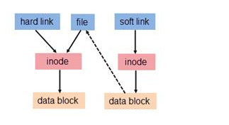

## symlink and hardlink

用户数据 (user data) 与元数据 (metadata)。

用户数据，即文件数据块 (data block)，数据块是记录文件真实内容的地方；

而元数据则是文件的附加属性，如文件大小、创建时间、所有者等信息。

若文件用户数据块中存放的内容是另一文件的路径名的指向，则该文件就是软连接。软链接就是一个普通文件，只是数据块内容有点特殊。

### 硬链接

与更加现代的符号链接相比，硬链接是最初 Unix 创建链接的方式。每个文件默认会有一个硬链接， 这个硬链接给予文件名字。我们每创建一个硬链接，就为一个文件创建了一个额外的目录项。 硬链接有两个重要局限性：

1. 一个硬链接不能关联它所在文件系统之外的文件。这是说一个链接不能关联 与链接本身不在同一个磁盘分区上的文件。

2. 一个硬链接不能关联一个目录。    

   https://askubuntu.com/questions/210741/why-are-hard-links-not-allowed-for-directories

   

一个硬链接和文件本身没有什么区别。不像符号链接，当你列出一个包含硬链接的目录 内容时，你会看到没有特殊的链接指示说明。当一个硬链接被删除时，这个链接 被删除，但是文件本身的内容仍然存在（这是说，它所占的磁盘空间不会被重新分配）， 直到所有关联这个文件的链接都删除掉。知道硬链接很重要，因为你可能有时 会遇到它们，但现在实际中更喜欢使用符号链接，下一步我们会讨论符号链接。

### 符号链接

> 符号链接有自己的innode

创建符号链接是为了克服硬链接的局限性。符号链接生效，是通过创建一个 特殊类型的文件，这个文件包含一个关联文件或目录的文本指针。在这一方面， 它们和 Windows 的快捷方式差不多，当然，符号链接早于 Windows 的快捷方式 很多年;-)

一个符号链接指向一个文件，而且这个符号链接本身与其它的符号链接几乎没有区别。 例如，如果你往一个符号链接里面写入东西，那么相关联的文件也被写入。然而， 当你删除一个符号链接时，只有这个链接被删除，而不是文件自身。如果先于符号链接 删除文件，这个链接仍然存在，但是不指向任何东西。在这种情况下，这个链接被称为 坏链接。在许多实现中，ls 命令会以不同的颜色展示坏链接，比如说红色，来显示它们 的存在。

https://www.ibm.com/developerworks/cn/linux/l-cn-hardandsymb-links/index.html#fig2