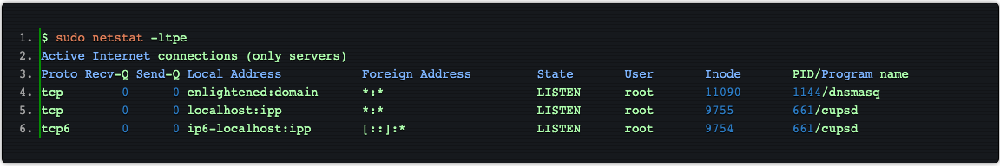

# 常见命令

## netstat


```shell
netstat -a #列出所有当前的连接(监听状态的,已经遇到的)
netstat -at #列出所有当前的TCP连接  -au 列出所有当前的UDP连接
netstat -ant # -n禁用反向域名解析，加快查询速度
netstat -tnl # 只列出监听中的连接

~$ sudo netstat -nlpt #  -p 选项查看进程信息
Active Internet connections (only servers)
Proto Recv-Q Send-Q Local Address           Foreign Address         State       PID/Program name
tcp        0      0 127.0.1.1:53            0.0.0.0:*               LISTEN      1144/dnsmasq    
tcp        0      0 127.0.0.1:631           0.0.0.0:*               LISTEN      661/cupsd       
tcp6       0      0 ::1:631                 :::*                    LISTEN      661/cupsd


$ sudo netstat -ltpe # 使用 -ep 选项可以同时查看进程名和用户名

```



参考

https://linux.cn/article-2434-1.html


