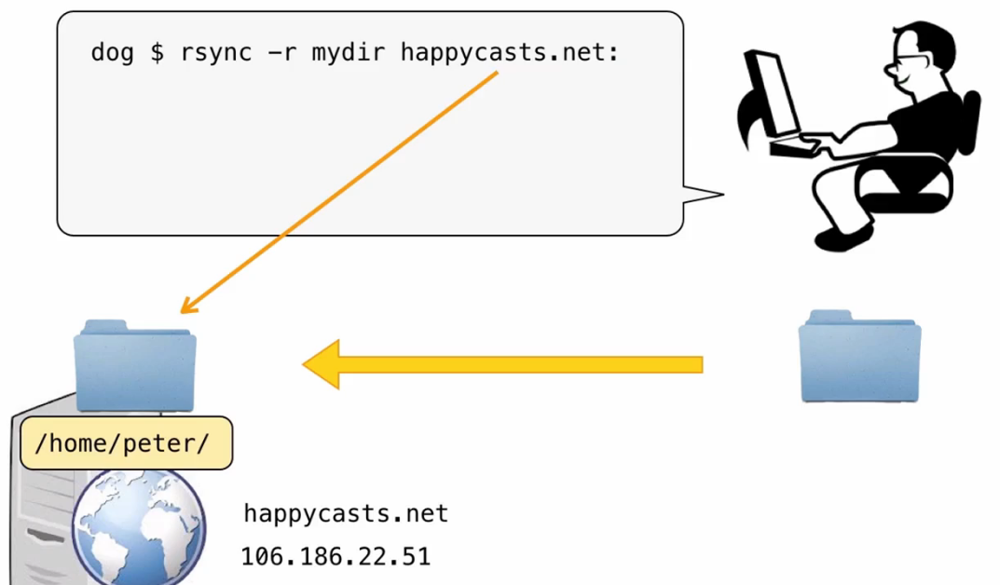

## 数据同步rsync



注意mydir没有斜杠 user@server： 要有冒号


#### 增加上传

```shell
$ rsync -av mydir/ user@server：mydir/
```


#### 增加上传并删除过期的文件

```shell
$ rsync -av --delete mydir/ user@server：mydir/
```


#### 同步脚本

先执行dry-run


#### 反向操作

```shell
$ rsync  -r user@server:mydir  .
```

