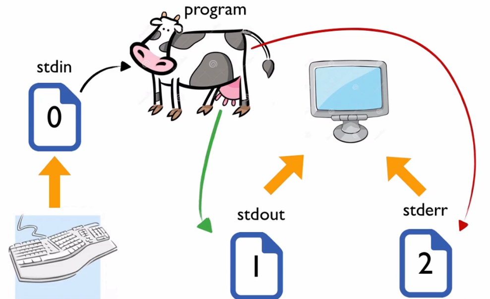

## 重定向


#### 固定的文件描述符




#### redirect stdout

标准输出重定向

`>`

```shell
# 输出重定向 覆盖
$ who > test6
$ cat test6
user     pts/0    Feb 10 17:55

# 输出重定向 追加
$ date >> test6
$ cat test6
user     pts/0    Feb 10 17:55
Thu Feb 10 18:02:14 EDT 2014

```


#### redirect stdin

标准输入重定向

`<`

```shell
$ command < inputfile
$ wc < test6
2 11 60

wc命令可以对对数据中的文本进行计数。默认情况下，它会输出3个值:
文本的行数
文本的词数
文本的字节数
```


#### 内联输入重定向(inline input redirection)

```shell
$ wc << EOF
> test string 1
> test string 2
> test string 3
> EOF
3 9 42
```


#### redirect stderr

标准错误输出重定向

`2>`


