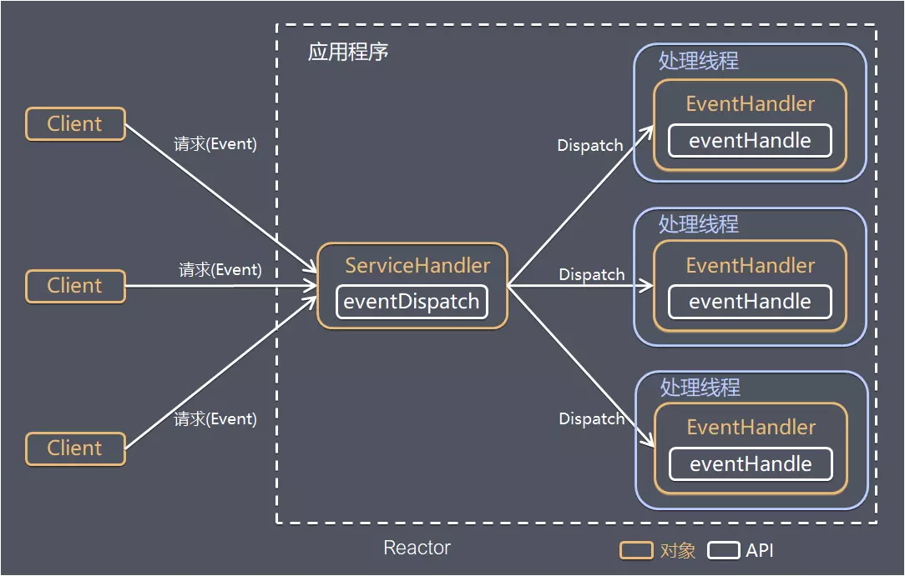
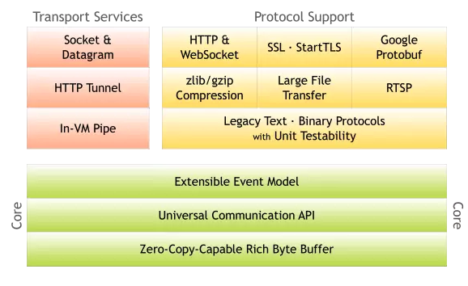
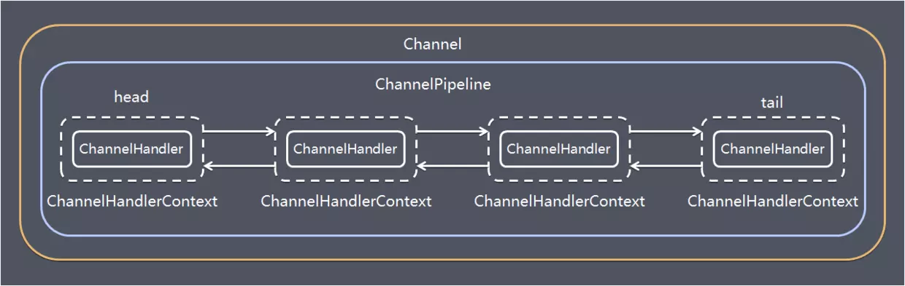
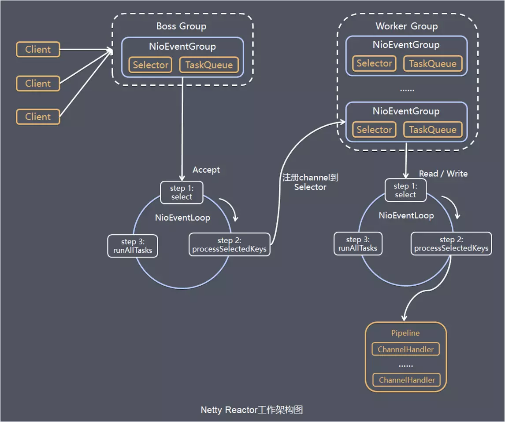

# netty

## 有了Java NIO 为何需要Netty

强烈不建议直接基于JDK原生NIO来进行网络开发，除非你的经验很丰富，要重新撸一个轮子。

1. JDK 的 NIO 编程需要了解很多的概念，编程复杂，对 NIO 入门非常不友好，编程模型不友好，ByteBuffer 的 Api 也有些违反尝试。

2. 原始，无默认实现，需要自己手撸

   - 对 NIO 编程来说，一个比较合适的线程模型能充分发挥它的优势，而 JDK 没有给你实现
   - 简单的自定义协议拆包都要你自己实现，否则会有粘包之类的问题。

3. JDK 的 NIO有坑，比如 底层由 epoll 实现，该实现饱受诟病的空轮询 bug 会导致 cpu 飙升 100%

   jdk不认为这是java的bug,需要开发者手动避免。

4. 项目庞大之后，自行实现的 NIO 很容易出现各类 bug，维护成本较高，有许多坑需要自己重新踩。

这也是netty出现的原因。


## 使用netty的优势

1、使用 JDK 自带的NIO需要了解太多的概念，编程复杂，一不小心 bug 横飞

2、Netty 底层 IO 模型随意切换，而这一切只需要做微小的改动，改改参数，Netty可以直接从 NIO 模型变身为 IO 模型

3、Netty 自带的拆包解包，异常检测等机制让你从NIO的繁重细节中脱离出来，让你只需要关心业务逻辑

4、Netty 解决了 JDK 的很多包括空轮询在内的 Bug

5、Netty 底层对线程，selector 做了很多细小的优化，精心设计的 reactor 线程模型做到非常高效的并发处理

6、自带各种协议栈让你处理任何一种通用协议都几乎不用亲自动手

7、Netty 社区活跃，遇到问题随时邮件列表或者 issue

8、Netty 已经历各大 RPC 框架，消息中间件，分布式通信中间件线上的广泛验证，健壮性无比强大


##  网络模型

### 事件驱动模型

通常，我们设计一个事件处理模型的程序有两种思路

- **轮询方式** 线程不断轮询访问相关事件发生源有没有发生事件，有发生事件就调用事件处理逻辑。

- **事件驱动方式** 

  发生事件，主线程把事件放入事件队列，在另外线程不断循环消费事件列表中的事件，调用事件对应的处理逻辑处理事件。事件驱动方式也被称为消息通知方式，其实是设计模式中**观察者模式**的思路。

以GUI的逻辑处理为例，说明两种逻辑的不同：

- 轮询方式 线程不断轮询是否发生按钮点击事件，如果发生，调用处理逻辑
- 事件驱动方式 发生点击事件把事件放入事件队列，在另外线程消费的事件列表中的事件，根据事件类型调用相关事件处理逻辑

### Reactor线程模型

Reactor是反应堆的意思，Reactor模型，是指通过一个或多个输入同时传递给服务处理器的服务请求的**事件驱动处理模式**。 服务端程序处理传入多路请求，并将它们同步分派给请求对应的处理线程。


Reactor模型中有2个关键组成：

- Reactor Reactor在一个单独的线程中运行，负责监听和分发事件，分发给适当的处理程序来对IO事件做出反应。 它就像公司的电话接线员，它接听来自客户的电话并将线路转移到适当的联系人
- Handlers 处理程序执行I/O事件要完成的实际事件，类似于客户想要与之交谈的公司中的实际官员。Reactor通过调度适当的处理程序来响应I/O事件，处理程序执行非阻塞操作



取决于Reactor的数量和Hanndler线程数量的不同，Reactor模型有3个变种

- 单Reactor单线程
- 单Reactor多线程
- 主从Reactor多线程

可以这样理解，Reactor就是一个执行while (true) { selector.select(); ...}循环的线程，会源源不断的产生新的事件，称作反应堆很贴切。

**参考**

https://www.jianshu.com/p/2965fca6bb8f


### Netty线程模型

Netty主要**基于主从Reactors多线程模型**（如下图）做了一定的修改，其中主从Reactor多线程模型有多个Reactor：MainReactor和SubReactor：

- MainReactor负责客户端的连接请求，并将请求转交给SubReactor
- SubReactor负责相应通道的IO读写请求
- 非IO请求（具体逻辑处理）的任务则会直接写入队列，等待worker threads进行处理


特别说明的是： 虽然Netty的线程模型基于主从Reactor多线程，借用了MainReactor和SubReactor的结构，但是实际实现上，SubReactor和Worker线程在同一个线程池中：

```java
EventLoopGroup bossGroup = new NioEventLoopGroup();
EventLoopGroup workerGroup = new NioEventLoopGroup();
ServerBootstrap server = new ServerBootstrap();
server.group(bossGroup, workerGroup)
 .channel(NioServerSocketChannel.class)
```


上面代码中的bossGroup 和workerGroup是Bootstrap构造方法中传入的两个对象，这两个group均是线程池

- bossGroup线程池则只是在bind某个端口后，获得其中一个线程作为MainReactor，专门处理端口的accept事件，**每个端口对应一个boss线程**
- workerGroup线程池会被各个SubReactor和worker线程充分利用

## netty架构设计

### 功能特性



- 拥有设计良好且统一的API，支持NIO与OIO（阻塞IO）等多种传输类型，支持真正的无连接UDP Socket。

- 简单而强大的线程模型，可高度定制线程（池）。

- 良好的模块化与解耦，core支持可扩展和灵活的事件模型，可以很轻松地分离关注点以复用逻辑组件（可插拔的）。

- 性能高效，拥有比Java核心API更高的吞吐量，支持零拷贝的ByteBuf缓冲对象,通过zero-copy功能以实现最少的内存复制消耗。

- 内置了许多常用的协议编解码器，如HTTP、SSL、WebScoket等常见协议可以通过Netty做到开箱即用。用户也可以利用Netty编解码器,简单方便地实现自己的应用层协议。

- 容器集成 支持OSGI、JBossMC、Spring、Guice容器

### 模块组件简介

#### Bootstrap、ServerBootstrap

Bootstrap意思是引导，一个Netty应用通常由一个Bootstrap开始，主要作用是配置整个Netty程序，串联各个组件，Netty中Bootstrap类是客户端程序的启动引导类，ServerBootstrap是服务端启动引导类。

#### Future、ChannelFuture

正如前面介绍，在Netty中所有的IO操作都是异步的，不能立刻得知消息是否被正确处理，但是可以过一会等它执行完成或者直接注册一个监听，具体的实现就是通过Future和ChannelFutures，他们可以注册一个监听，当操作执行成功或失败时监听会自动触发注册的监听事件。

#### Channel

Netty网络通信的组件，能够用于执行网络I/O操作。 Channel为用户提供：

- 当前网络连接的通道的状态（例如是否打开？是否已连接？）
- 网络连接的配置参数 （例如接收缓冲区大小）
- 提供异步的网络I/O操作(如建立连接，读写，绑定端口)，异步调用意味着任何I/O调用都将立即返回，并且不保证在调用结束时所请求的I / O操作已完成。调用立即返回一个ChannelFuture实例，通过注册监听器到ChannelFuture上，可以I / O操作成功、失败或取消时回调通知调用方。
- 支持关联I/O操作与对应的处理程序


不同协议、不同的阻塞类型的连接都有不同的 Channel 类型与之对应，下面是一些常用的 Channel 类型

- NioSocketChannel，异步的客户端 TCP Socket 连接
- NioServerSocketChannel，异步的服务器端 TCP Socket 连接
- NioDatagramChannel，异步的 UDP 连接
- NioSctpChannel，异步的客户端 Sctp 连接
- NioSctpServerChannel，异步的 Sctp 服务器端连接 这些通道涵盖了 UDP 和 TCP网络 IO以及文件 IO.


#### Selector

Netty基于Selector对象实现I/O多路复用，通过 Selector, 一个线程可以监听多个连接的Channel事件, 当向一个Selector中注册Channel 后，Selector 内部的机制就可以自动不断地查询(select) 这些注册的Channel是否有已就绪的I/O事件(例如可读, 可写, 网络连接完成等)，这样程序就可以很简单地使用一个线程高效地管理多个 Channel 。

#### ChannelHandler

ChannelHandler是一个接口，处理I/O事件或拦截I/O操作，并将其转发到其ChannelPipeline(业务处理链)中的下一个处理程序。

ChannelHandler本身并没有提供很多方法，因为这个接口有许多的方法需要实现，方便使用期间，可以继承它的子类：

- ChannelInboundHandler用于处理入站I/O事件
- ChannelOutboundHandler用于处理出站I/O操作

或者使用以下适配器类：

- ChannelInboundHandlerAdapter用于处理入站I / O事件
- ChannelOutboundHandlerAdapter用于处理出站I / O操作
- ChannelDuplexHandler用于处理入站和出站事件

#### ChannelHandlerContext

保存Channel相关的所有上下文信息，同时关联一个ChannelHandler对象


#### ChannelPipline

保存ChannelHandler的List，用于处理或拦截Channel的入站事件和出站操作。 ChannelPipeline实现了一种高级形式的拦截过滤器模式，使用户可以完全控制事件的处理方式，以及Channel中各个的ChannelHandler如何相互交互。


下图引用Netty的Javadoc4.1中ChannelPipline的说明，描述了ChannelPipeline中ChannelHandler通常如何处理I/O事件。 I/O事件由ChannelInboundHandler或ChannelOutboundHandler处理，并通过调用ChannelHandlerContext中定义的事件传播方法（例如ChannelHandlerContext.fireChannelRead（Object）和ChannelOutboundInvoker.write（Object））转发到其最近的处理程序。


```java
                                                 I/O Request
                                            via Channel or
                                        ChannelHandlerContext
                                                      |
  +---------------------------------------------------+---------------+
  |                           ChannelPipeline         |               |
  |                                                  \|/              |
  |    +---------------------+            +-----------+----------+    |
  |    | Inbound Handler  N  |            | Outbound Handler  1  |    |
  |    +----------+----------+            +-----------+----------+    |
  |              /|\                                  |               |
  |               |                                  \|/              |
  |    +----------+----------+            +-----------+----------+    |
  |    | Inbound Handler N-1 |            | Outbound Handler  2  |    |
  |    +----------+----------+            +-----------+----------+    |
  |              /|\                                  .               |
  |               .                                   .               |
  | ChannelHandlerContext.fireIN_EVT() ChannelHandlerContext.OUT_EVT()|
  |        [ method call]                       [method call]         |
  |               .                                   .               |
  |               .                                  \|/              |
  |    +----------+----------+            +-----------+----------+    |
  |    | Inbound Handler  2  |            | Outbound Handler M-1 |    |
  |    +----------+----------+            +-----------+----------+    |
  |              /|\                                  |               |
  |               |                                  \|/              |
  |    +----------+----------+            +-----------+----------+    |
  |    | Inbound Handler  1  |            | Outbound Handler  M  |    |
  |    +----------+----------+            +-----------+----------+    |
  |              /|\                                  |               |
  +---------------+-----------------------------------+---------------+
                  |                                  \|/
  +---------------+-----------------------------------+---------------+
  |               |                                   |               |
  |       [ Socket.read() ]                    [ Socket.write() ]     |
  |                                                                   |
  |  Netty Internal I/O Threads (Transport Implementation)            |
  +-------------------------------------------------------------------+

```

入站事件由自下而上方向的入站处理程序处理，如图左侧所示。 入站Handler处理程序通常处理由图底部的I / O线程生成的入站数据。 通常通过实际输入操作（例如SocketChannel.read（ByteBuffer））从远程读取入站数据。

出站事件由上下方向处理，如图右侧所示。 出站Handler处理程序通常会生成或转换出站传输，例如write请求。 I/O线程通常执行实际的输出操作，例如SocketChannel.write（ByteBuffer）。

在 Netty 中每个 Channel 都有且仅有一个 ChannelPipeline 与之对应, 它们的组成关系如下:




一个 Channel 包含了一个 ChannelPipeline, 而 ChannelPipeline 中又维护了一个由 ChannelHandlerContext 组成的双向链表, 并且每个 ChannelHandlerContext 中又关联着一个 ChannelHandler。入站事件和出站事件在一个双向链表中，入站事件会从链表head往后传递到最后一个入站的handler，出站事件会从链表tail往前传递到最前一个出站的handler，两种类型的handler互不干扰。


#### NioEventLoop

NioEventLoop中维护了一个线程和任务队列，支持异步提交执行任务，线程启动时会调用NioEventLoop的run方法，执行I/O任务和非I/O任务：

- I/O任务 即selectionKey中ready的事件，如accept、connect、read、write等，由processSelectedKeys方法触发。
- 非IO任务 添加到taskQueue中的任务，如register0、bind0等任务，由runAllTasks方法触发。

两种任务的执行时间比由变量ioRatio控制，默认为50，则表示允许非IO任务执行的时间与IO任务的执行时间相等。

#### NioEventLoopGroup

NioEventLoopGroup，主要管理eventLoop的生命周期，可以理解为一个线程池，内部维护了一组线程，每个线程(NioEventLoop)负责处理多个Channel上的事件，而一个Channel只对应于一个线程。


## 服务端运行浅析

初始化并启动Netty服务端过程如下：

```java
    public static void main(String[] args) {
        // 创建mainReactor
        NioEventLoopGroup bossGroup = new NioEventLoopGroup();
        // 创建工作线程组
        NioEventLoopGroup workerGroup = new NioEventLoopGroup();

        final ServerBootstrap serverBootstrap = new ServerBootstrap();
        serverBootstrap 
                 // 组装NioEventLoopGroup 
                .group(boosGroup, workerGroup)
                 // 设置channel类型为NIO类型
                .channel(NioServerSocketChannel.class)
                // 设置连接配置参数
                .option(ChannelOption.SO_BACKLOG, 1024)
                .childOption(ChannelOption.SO_KEEPALIVE, true)
                .childOption(ChannelOption.TCP_NODELAY, true)
                // 配置入站、出站事件handler
                .childHandler(new ChannelInitializer<NioSocketChannel>() {
                    @Override
                    protected void initChannel(NioSocketChannel ch) {
                        // 配置入站、出站事件channel
                        ch.pipeline().addLast(...);
                        ch.pipeline().addLast(...);
                    }
    });

        // 绑定端口
        int port = 8080;
        serverBootstrap.bind(port).addListener(future -> {
            if (future.isSuccess()) {
                System.out.println(new Date() + ": 端口[" + port + "]绑定成功!");
            } else {
                System.err.println("端口[" + port + "]绑定失败!");
            }
        });
}

```

基本过程如下：

1 初始化创建2个NioEventLoopGroup，其中boosGroup用于Accetpt连接建立事件并分发请求， workerGroup用于处理I/O读写事件和业务逻辑

2  基于ServerBootstrap(服务端启动引导类)，配置EventLoopGroup、Channel类型，连接参数、配置入站、出站事件handler

3 绑定端口，开始工作


结合上面的介绍的Netty Reactor模型，介绍服务端Netty的工作架构图：



server端包含1个Boss NioEventLoopGroup和1个Worker NioEventLoopGroup，NioEventLoopGroup相当于1个事件循环组，这个组里包含多个事件循环NioEventLoop，每个NioEventLoop包含1个selector和1个事件循环线程。


每个Boss NioEventLoop循环执行的任务包含3步：

- 1 轮询accept事件
- 2 处理accept I/O事件，与Client建立连接，生成NioSocketChannel，并将NioSocketChannel注册到某个Worker NioEventLoop的Selector上 
- 3 处理任务队列中的任务，runAllTasks。任务队列中的任务包括用户调用eventloop.execute或schedule执行的任务，或者其它线程提交到该eventloop的任务。

每个Worker NioEventLoop循环执行的任务包含3步：

- 1 轮询read、write事件；
- 2 处I/O事件，即read、write事件，在NioSocketChannel可读、可写事件发生时进行处理
- 3 处理任务队列中的任务，runAllTasks。

其中任务队列中的task有3种典型使用场景

- 1 用户程序自定义的普通任务

```java
ctx.channel().eventLoop().execute(new Runnable() {
    @Override
    public void run() {
        //...
    }
});
```

- 2 非当前reactor线程调用channel的各种方法 例如在推送系统的业务线程里面，根据用户的标识，找到对应的channel引用，然后调用write类方法向该用户推送消息，就会进入到这种场景。最终的write会提交到任务队列中后被异步消费。
- 3 用户自定义定时任务

```java
ctx.channel().eventLoop().schedule(new Runnable() {
    @Override
    public void run() {

    }
}, 60, TimeUnit.SECONDS);
```


## netty 源码
