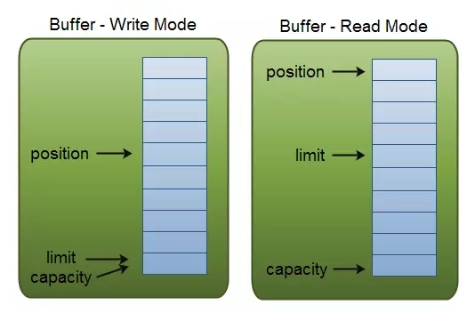

# ByteBuf

## 为什么还需要ByteBuf

网络传输的基本单位是字节，在Java NIO中提供了ByteBuffer作为字节缓冲区容器，但该类的API使用起来不太方便，所以Netty实现了ByteBuf作为其替代品，下面是使用ByteBuf的优点：

- 相比`ByteBuffer`使用起来更加简单。
- 通过**内置的复合缓冲区类型实现了透明的zero-copy**。
- 容量可以按需增长。
- 读和写使用了不同的索引指针。
- 支持链式调用。
- 支持引用计数与池化。
- 可以被用户自定义的缓冲区类型扩展。

## ByteBuffer

ByteBuffer继承于`abstract class Buffer`（所以还有LongBuffer、IntBuffer等其他类型的实现），本质上它只是一个有限的线性的元素序列，包含了三个重要的属性。

- Capacity：缓冲区中元素的容量大小，你只能将capacity个数量的元素写入缓冲区，一旦缓冲区已满就需要清理缓冲区才能继续写数据。
- Position：指向下一个写入数据位置的索引指针，初始位置为0，最大为capacity-1。当写模式转换为读模式时，position需要被重置为0,limit变成最大索引。
- Limit：在写模式中，limit是可以写入缓冲区的最大索引，也就是说它在写模式中等价于缓冲区的容量。在读模式中，limit表示可以读取数据的最大索引。




**由于Buffer中只维护了position一个索引指针，所以它在读写模式之间的切换需要调用一个flip()方法来重置指针。十分麻烦.**

使用Buffer的流程一般如下：

- 写入数据到缓冲区。
- 调用flip()方法。
- 从缓冲区中读取数据
- 调用buffer.clear()或者buffer.compact()清理缓冲区，以便下次写入数据。

```java
RandomAccessFile aFile = new RandomAccessFile("data/nio-data.txt", "rw");
FileChannel inChannel = aFile.getChannel();

// 分配一个48字节大小的缓冲区
ByteBuffer buf = ByteBuffer.allocate(48);

int bytesRead = inChannel.read(buf); // 读取数据到缓冲区
while (bytesRead != -1) {

  buf.flip();  // 将position重置为0

  while(buf.hasRemaining()){
      System.out.print((char) buf.get()); // 读取数据并输出到控制台
  }

  buf.clear(); // 清理缓冲区
  bytesRead = inChannel.read(buf);
}
aFile.close();

```

## ByteBuf

#### 双索引 read write

Java NIO中的Buffer API操作的麻烦之处就在于读写转换需要手动重置指针。而**ByteBuf没有这种繁琐性，它维护了两个不同的索引，一个用于读取，一个用于写入**。

当你从ByteBuf读取数据时，它的readerIndex将会被递增已经被读取的字节数，同样的，当你写入数据时，writerIndex则会递增。readerIndex的最大范围在writerIndex的所在位置，如果试图移动readerIndex超过该值则会触发异常。

ByteBuf中名称以read或write开头的方法将会递增它们其对应的索引，而名称以get或set开头的方法则不会。ByteBuf同样可以指定一个最大容量，试图移动writerIndex超过该值则会触发异常。


#### 内存分配

ByteBuf同样支持在堆内和堆外进行分配。在堆内分配也被称为支撑数组模式，它能在没有使用池化的情况下提供快速的分配和释放。

```java
ByteBuf heapBuf = Unpooled.copiedBuffer(bytes);
	if (heapBuf.hasArray()) { // 判断是否有一个支撑数组
		byte[] array = heapBuf.array();
		// 计算第一个字节的偏移量
		int offset = heapBuf.arrayOffset() + heapBuf.readerIndex();
		int length = heapBuf.readableBytes(); // 获得可读字节
		handleArray(array,offset,length); // 调用你的处理方法
	}
```

另一种模式为堆外分配，Java NIO ByteBuffer类在JDK1.4时就已经允许JVM实现通过JNI调用来在堆外分配内存（调用malloc()函数在JVM堆外分配内存），这主要是为了避免额外的缓冲区复制操作。

```java
ByteBuf directBuf = Unpooled.directBuffer(capacity);
	if (!directBuf.hasArray()) {
		int length = directBuf.readableBytes();
		byte[] array = new byte[length];
		// 将字节复制到数组中
		directBuf.getBytes(directBuf.readerIndex(),array);
		handleArray(array,0,length);
	}

```

ByteBuf还支持第三种模式，它被称为复合缓冲区，为多个ByteBuf提供了一个聚合视图。在这个视图中，你可以根据需要添加或者删除ByteBuf实例，ByteBuf的子类CompositeByteBuf实现了该模式。


一个适合使用复合缓冲区的场景是HTTP协议，通过HTTP协议传输的消息都会被分成两部分——头部和主体，如果这两部分由应用程序的不同模块产生，将在消息发送时进行组装，并且该应用程序还会为多个消息复用相同的消息主体，这样对于每个消息都将会创建一个新的头部，产生了很多不必要的内存操作。使用CompositeByteBuf是一个很好的选择，它消除了这些额外的复制，以帮助你复用这些消息。

```JAVA
CompositeByteBuf messageBuf = Unpooled.compositeBuffer();
	ByteBuf headerBuf = ....;
	ByteBuf bodyBuf = ....;
	messageBuf.addComponents(headerBuf,bodyBuf);
	for (ByteBuf buf : messageBuf) {
		System.out.println(buf.toString());
	}
```

CompositeByteBuf透明的实现了zero-copy，zero-copy其实就是避免数据在两个内存区域中来回的复制。从操作系统层面上来讲，zero-copy指的是避免在内核态与用户态之间的数据缓冲区复制（通过mmap避免），而Netty中的zero-copy更偏向于在用户态中的数据操作的优化，就像使用CompositeByteBuf来复用多个ByteBuf以避免额外的复制，也可以使用wrap()方法来将一个字节数组包装成ByteBuf，又或者使用ByteBuf的slice()方法把它分割为多个共享同一内存区域的ByteBuf，这些都是为了优化内存的使用率。

那么如何创建ByteBuf呢？在上面的代码中使用到了Unpooled，它是Netty提供的一个用于创建与分配ByteBuf的工具类，建议都使用这个工具类来创建你的缓冲区，不要自己去调用构造函数。经常使用的是wrappedBuffer()与copiedBuffer()，它们一个是用于将一个字节数组或ByteBuffer包装为一个ByteBuf，一个是根据传入的字节数组与ByteBuffer/ByteBuf来复制出一个新的ByteBuf。

```java
 // 通过array.clone()来复制一个数组进行包装
    public static ByteBuf copiedBuffer(byte[] array) {
        return array.length == 0?EMPTY_BUFFER:wrappedBuffer((byte[])array.clone());
    }

	// 默认是堆内分配
    public static ByteBuf wrappedBuffer(byte[] array) {
        return (ByteBuf)(array.length == 0?EMPTY_BUFFER:new UnpooledHeapByteBuf(ALLOC, array, array.length));
    }
	
  // 也提供了堆外分配的方法
    private static final ByteBufAllocator ALLOC;
	
    public static ByteBuf directBuffer(int initialCapacity) {
        return ALLOC.directBuffer(initialCapacity);
    }	

```

相对底层的分配方法是使用ByteBufAllocator，Netty实现了PooledByteBufAllocator和UnpooledByteBufAllocator，前者使用了[jemalloc（一种malloc()的实现）](https://link.juejin.im/?target=https%3A%2F%2Fgithub.com%2Fjemalloc%2Fjemalloc)来分配内存，并且实现了对ByteBuf的池化以提高性能。后者分配的是未池化的ByteBuf，其分配方式与之前讲的一致。

```java
	Channel channel = ...;
	ByteBufAllocator allocator = channel.alloc();
	ByteBuf buffer = allocator.directBuffer();
	do something.......
```

为了优化内存使用率，Netty提供了一套手动的方式来追踪不活跃对象，像`UnpooledHeapByteBuf`这种分配在堆内的对象得益于JVM的GC管理，无需额外操心，而`UnpooledDirectByteBuf`是在堆外分配的，它的内部基于`DirectByteBuffer`，`DirectByteBuffer`会先向Bits类申请一个额度（Bits还拥有一个全局变量totalCapacity，记录了所有DirectByteBuffer总大小），每次申请前都会查看是否已经超过-XX:MaxDirectMemorySize所设置的上限，如果超限就会尝试调用Sytem.gc()，以试图回收一部分内存，然后休眠100毫秒，如果内存还是不足，则只能抛出OOM异常。堆外内存的回收虽然有了这么一层保障，但为了提高性能与使用率，主动回收也是很有必要的。由于Netty还实现了ByteBuf的池化，像`PooledHeapByteBuf`和`PooledDirectByteBuf`就必须依赖于手动的方式来进行回收（放回池中）。


Netty使用了引用计数器的方式来追踪那些不活跃的对象。引用计数的接口为ReferenceCounted，它的思想很简单，只要ByteBuf对象的引用计数大于0，就保证该对象不会被释放回收，可以通过手动调用release()与retain()方法来操作该对象的引用计数值递减或递增。用户也可以通过自定义一个ReferenceCounted的实现类，以满足自定义的规则。

