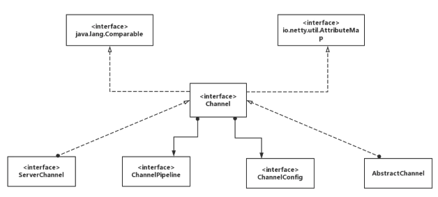

# Channel

## Netty channel

Netty中的Channel与Java NIO的概念一样，都是对一个实体或连接的抽象，但Netty提供了一套更加通用的API。就以网络套接字为例，在Java中OIO与NIO是截然不同的两套API，假设你之前使用的是OIO而又想更改为NIO实现，那么几乎需要重写所有代码。而在Netty中，只需要更改短短几行代码（更改Channel与EventLoop的实现类，如把OioServerSocketChannel替换为NioServerSocketChannel），就可以完成OIO与NIO（或其他）之间的转换。

**每个Channel最终都会被分配一个ChannelPipeline和ChannelConfig**，前者持有所有负责处理入站与出站数据以及事件的ChannelHandler，后者包含了该Channel的所有配置设置，并且支持热更新，由于不同的传输类型可能具有其特别的配置，所以该类可能会实现为ChannelConfig的不同子类。

Channel是线程安全的（与之后要讲的线程模型有关），因此你完全可以在多个线程中复用同一个Channel.

## channel 支持的IO类型与协议

Netty除了支持常见的NIO与OIO，还内置了其他的传输类型。

| Nmae     | Package                     | Description                                                  |
| -------- | --------------------------- | ------------------------------------------------------------ |
| NIO      | io.netty.channel.socket.nio | 以Java NIO为基础实现                                         |
| OIO      | io.netty.channel.socket.oio | 以java.net为基础实现，使用阻塞I/O模型                        |
| Epoll    | io.netty.channel.epoll      | 由JNI驱动epoll()实现的更高性能的非阻塞I/O，它只能使用在Linux |
| Local    | io.netty.channel.local      | 本地传输，在JVM内部通过管道进行通信                          |
| Embedded | io.netty.channel.embedded   | 允许在不需要真实网络传输的环境下使用ChannelHandler，主要用于对ChannelHandler进行测试 |

不同协议、不同的阻塞类型的连接都有不同的 Channel 类型与之对应，下面是一些常用的NIO类型的 Channel 

- NioSocketChannel，异步的客户端 TCP Socket 连接
- NioServerSocketChannel，异步的服务器端 TCP Socket 连接
- NioDatagramChannel，异步的 UDP 连接
- NioSctpChannel，异步的客户端 Sctp 连接
- NioSctpServerChannel，异步的 Sctp 服务器端连接 这些通道涵盖了 UDP 和 TCP网络 IO以及文件 IO.

## Channel 的功能

Netty网络通信的组件，能够用于执行网络I/O操作。 Channel为用户提供：

- 当前网络连接的通道的状态（例如是否打开？是否已连接？）
- 网络连接的配置参数 （例如接收缓冲区大小）
- 提供异步的网络I/O操作(如建立连接，读写，绑定端口)，异步调用意味着任何I/O调用都将立即返回，并且不保证在调用结束时所请求的I/O操作已完成。调用立即返回一个ChannelFuture实例，通过注册监听器到ChannelFuture上，可以I/O操作成功、失败或取消时回调通知调用方。
- 支持关联I/O操作与对应的处理程序

