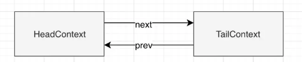
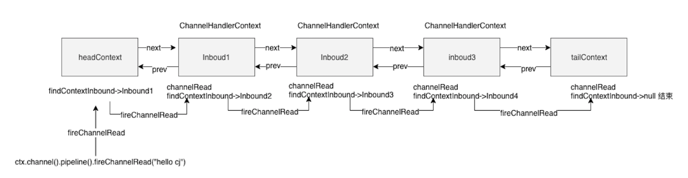
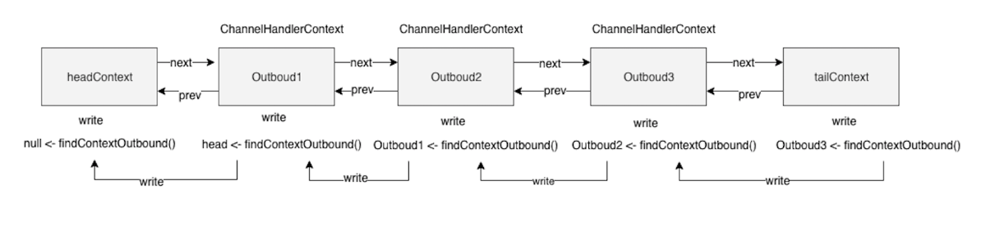

# ChannelPipeline

## 介绍

为了模块化与解耦合，不可能由一个ChannelHandler来完成所有应用逻辑，所以Netty采用了拦截器链的设计。ChannelPipeline就是用来管理ChannelHandler实例链的容器，它的职责就是保证实例链的流动。

每一个新创建的Channel都将会被分配一个新的ChannelPipeline，这种关联关系是永久性的，一个Channel一生只能对应一个ChannelPipeline。

```java
                                                 I/O Request
                                            via Channel or
                                        ChannelHandlerContext
                                                      |
  +---------------------------------------------------+---------------+
  |                           ChannelPipeline         |               |
  |                                                  \|/              |
  |    +---------------------+            +-----------+----------+    |
  |    | Inbound Handler  N  |            | Outbound Handler  M  |    |
  |    +----------+----------+            +-----------+----------+    |
  |              /|\                                  |               |
  |               |                                  \|/              |
  |    +----------+----------+            +-----------+----------+    |
  |    | Inbound Handler N-1 |            | Outbound Handler  M-1|    |
  |    +----------+----------+            +-----------+----------+    |
  |              /|\                                  .               |
  |               .                                   .               |
  | ChannelHandlerContext.fireIN_EVT() ChannelHandlerContext.OUT_EVT()|
  |        [ method call]                       [method call]         |
  |               .                                   .               |
  |               .                                  \|/              |
  |    +----------+----------+            +-----------+----------+    |
  |    | Inbound Handler  2  |            | Outbound Handler  2  |    |
  |    +----------+----------+            +-----------+----------+    |
  |              /|\                                  |               |
  |               |                                  \|/              |
  |    +----------+----------+            +-----------+----------+    |
  |    | Inbound Handler  1  |            | Outbound Handler  1  |    |
  |    +----------+----------+            +-----------+----------+    |
  |              /|\                                  |               |
  +---------------+-----------------------------------+---------------+
                  |                                  \|/
  +---------------+-----------------------------------+---------------+
  |               |                                   |               |
  |       [ Socket.read() ]                    [ Socket.write() ]     |
  |                                                                   |
  |  Netty Internal I/O Threads (Transport Implementation)            |
  +-------------------------------------------------------------------+
```

Inbound（入站）事件由Inbound处理程序以自下而上的方向处理，如图所示。Inbound处理程序通常处理由图底部的I/O线程生成的Inbound数据。 Inbound数据通常通过实际的输入操作（如SocketChannel.read（ByteBuffer））从远程对等端读取。 如果Inbound事件超出顶层入站处理程序，它将被静默放弃，或者在需要您关注时进行记录。

一个Outbound（出站）事件由Outbound处理程序在自上而下的方向进行处理，如图所示。Outbound处理程序通常会生成或转换Outbound流量，如写入请求。 如果出站事件超出底部出站处理程序，则由与该通道关联的I / O线程处理。 I/O线程经常执行实际的输出操作，例如SocketChannel.write（ByteBuffer）。


Netty总是将ChannelPipeline的入站口作为头部，而将出站口作为尾部。在事件传播的过程中，ChannelPipeline会判断下一个ChannelHandler的类型是否和事件的运动方向相匹配，如果不匹配，就跳过该ChannelHandler并继续检查下一个（保证入站事件只会被ChannelInboundHandler处理），一个ChannelHandler也可以同时实现ChannelInboundHandler与ChannelOutboundHandler，它在入站事件与出站事件中都会被调用。


**举个例子**

```java
 ChannelPipeline p = ...;
 p.addLast（“1”，new InboundHandlerA（））;
 p.addLast（“2”，new InboundHandlerB（））;
 p.addLast（“3”，new OutboundHandlerA（））;
 p.addLast（“4”，new OutboundHandlerB（））;
 p.addLast（“5”，new InboundOutboundHandlerX（））;
```

    当事件进入时，处理程序评估顺序为1，2，3，4，5
    3和4不实现ChannelInboundHandler，因此入站事件的实际评估顺序将为：1,2和5。
    当事件出站时，顺序为5,4,3,2,1
    1和2不实现ChannelOutboundHandler，因此出站事件的实际评估顺序将为：5，4和3。


## ChannelPipeline实现

双向链表



入站



出站



参考:

https://juejin.im/post/5cf9f2036fb9a07ec955ff58


## ChannelHandlerContext

在阅读ChannelHandler的源码时，发现很多方法需要一个ChannelHandlerContext类型的参数，该接口是ChannelPipeline与ChannelHandler之间相关联的关键。ChannelHandlerContext可以通知ChannelPipeline中的当前ChannelHandler的下一个ChannelHandler，还可以动态地改变当前ChannelHandler在ChannelPipeline中的位置（通过调用ChannelPipeline中的各种方法来修改）。

ChannelHandlerContext负责了在同一个ChannelPipeline中的ChannelHandler与其他ChannelHandler之间的交互，每个ChannelHandlerContext都对应了一个ChannelHandler。在DefaultChannelPipeline的源码中，已经表现的很明显了。

```java
public class DefaultChannelPipeline implements ChannelPipeline {
    .........
	// 头部节点和尾部节点的引用变量
	// ChannelHandlerContext在ChannelPipeline中是以链表的形式组织的
    final AbstractChannelHandlerContext head; 
    final AbstractChannelHandlerContext tail;	
	.........
	
	// 添加一个ChannelHandler到链表尾部
    public final ChannelPipeline addLast(String name, ChannelHandler handler) {
        return this.addLast((EventExecutorGroup)null, name, handler);
    }

    public final ChannelPipeline addLast(EventExecutorGroup group, String name, ChannelHandler handler) {
        final AbstractChannelHandlerContext newCtx;
        synchronized(this) {
			// 检查ChannelHandler是否为一个共享对象(@Sharable)
			// 如果该ChannelHandler没有@Sharable注解，并且是已被添加过的那么就抛出异常
            checkMultiplicity(handler); 
			// 返回一个DefaultChannelHandlerContext，注意该对象持有了传入的ChannelHandler
            newCtx = this.newContext(group, this.filterName(name, handler), handler);
            this.addLast0(newCtx);
			// 如果当前ChannelPipeline没有被注册，那么就先加到未决链表中
            if(!this.registered) {
                newCtx.setAddPending();
                this.callHandlerCallbackLater(newCtx, true);
                return this;
            }
			
			// 否则就调用ChannelHandler中的handlerAdded()
            EventExecutor executor = newCtx.executor();
            if(!executor.inEventLoop()) {
                newCtx.setAddPending();
                executor.execute(new Runnable() {
                    public void run() {
                        DefaultChannelPipeline.this.callHandlerAdded0(newCtx);
                    }
                });
                return this;
            }
        }

        this.callHandlerAdded0(newCtx);
        return this;
    }
	
	// 将新的ChannelHandlerContext插入到尾部与尾部之前的节点之间
    private void addLast0(AbstractChannelHandlerContext newCtx) {
        AbstractChannelHandlerContext prev = this.tail.prev;
        newCtx.prev = prev;
        newCtx.next = this.tail;
        prev.next = newCtx;
        this.tail.prev = newCtx;
    }
	.....
}

```

ChannelHandlerContext还定义了许多与Channel和ChannelPipeline重合的方法（像read()、write()、connect()这些用于出站的方法或者如fireChannelXXXX()这样用于入站的方法），不同之处在于调用Channel或者ChannelPipeline上的这些方法，它们将会从头沿着整个ChannelHandler实例链进行传播，而调用位于ChannelHandlerContext上的相同方法，则会从当前所关联的ChannelHandler开始，且只会传播给实例链中的下一个ChannelHandler。而且，事件之间的移动（从一个ChannelHandler到下一个ChannelHandler）也是通过ChannelHandlerContext中的方法调用完成的。

```java
public class DefaultChannelPipeline implements ChannelPipeline {	

    public final ChannelPipeline fireChannelRead(Object msg) {
		// 注意这里将头节点传入了进去
        AbstractChannelHandlerContext.invokeChannelRead(this.head, msg);
        return this;
    }
	
}

abstract class AbstractChannelHandlerContext extends DefaultAttributeMap implements ChannelHandlerContext, ResourceLeakHint {

    static void invokeChannelRead(final AbstractChannelHandlerContext next, Object msg) {
        final Object m = next.pipeline.touch(ObjectUtil.checkNotNull(msg, "msg"), next);
        EventExecutor executor = next.executor();
        if(executor.inEventLoop()) {
            next.invokeChannelRead(m);
        } else {
            executor.execute(new Runnable() {
                public void run() {
                    next.invokeChannelRead(m);
                }
            });
        }

    }
	
    private void invokeChannelRead(Object msg) {
        if(this.invokeHandler()) {
            try {
                ((ChannelInboundHandler)this.handler()).channelRead(this, msg);
            } catch (Throwable var3) {
                this.notifyHandlerException(var3);
            }
        } else {
			// 寻找下一个ChannelHandler
            this.fireChannelRead(msg);
        }

    }	

    public ChannelHandlerContext fireChannelRead(Object msg) {
        invokeChannelRead(this.findContextInbound(), msg);
        return this;
    }

    private AbstractChannelHandlerContext findContextInbound() {
        AbstractChannelHandlerContext ctx = this;

        do {
            ctx = ctx.next;
        } while(!ctx.inbound); // 直到找到一个ChannelInboundHandler

        return ctx;
    }
	
}
```

