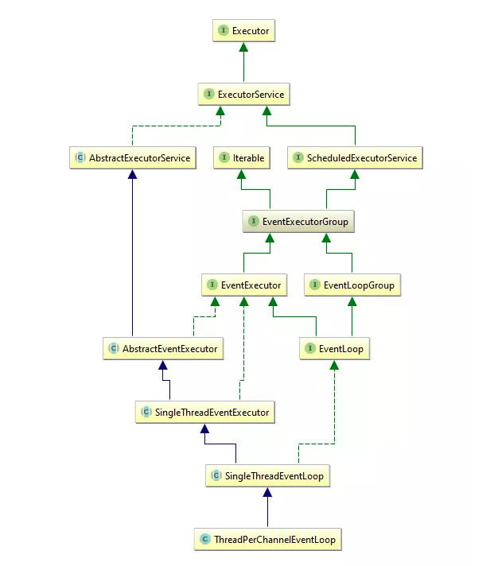

# EventLoop

## 介绍

为了最大限度地提供高性能和可维护性，Netty设计了一套强大又易用的线程模型。在一个网络框架中，最重要的能力是能够快速高效地处理在连接的生命周期内发生的各种事件，与之相匹配的程序构造被称为事件循环，Netty定义了接口EventLoop来负责这项工作。

如果是经常用Java进行多线程开发的童鞋想必经常会使用到线程池，也就是Executor这套API。Netty就是从Executor（java.util.concurrent）之上扩展了自己的EventExecutorGroup（io.netty.util.concurrent），同时为了与Channel的事件进行交互，还扩展了EventLoopGroup接口（io.netty.channel）。在io.netty.util.concurrent包下的EventExecutorXXX负责实现线程并发相关的工作，而在io.netty.channel包下的EventLoopXXX负责实现网络编程相关的工作（处理Channel中的事件）。

**在Netty的线程模型中，一个EventLoop将由一个永远不会改变的Thread驱动，而一个Channel一生只会使用一个EventLoop（但是一个EventLoop可能会被指派用于服务多个Channel），在Channel中的所有I/O操作和事件都由EventLoop中的线程处理，也就是说一个Channel的一生之中都只会使用到一个线程**。不过在Netty3，只有入站事件会被EventLoop处理，所有出站事件都会由调用线程处理，这种设计导致了ChannelHandler的线程安全问题。Netty4简化了线程模型，通过在同一个线程处理所有事件，既解决了这个问题，还提供了一个更加简单的架构。

