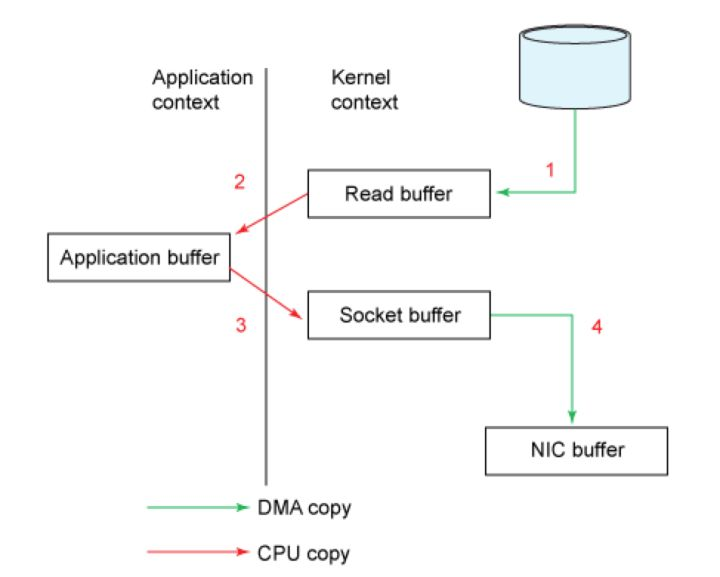
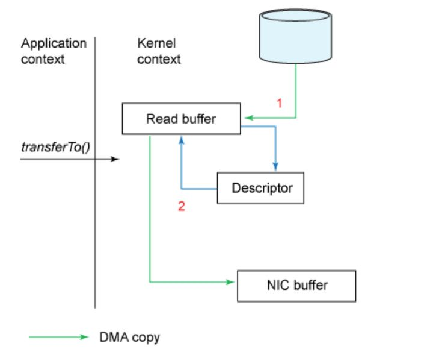
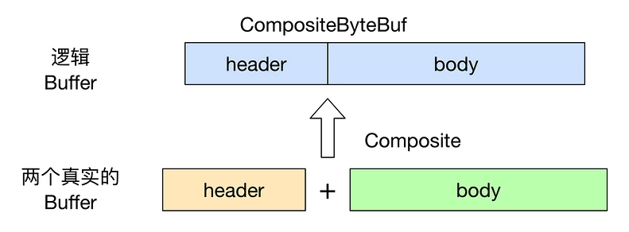
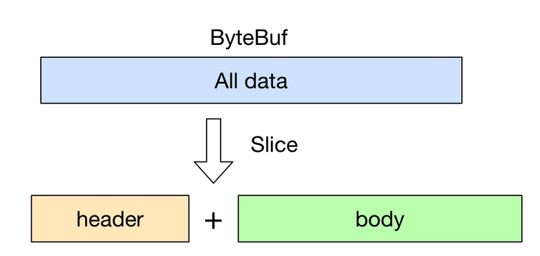

# netty零拷贝

## 操作系统的零拷贝

> "Zero-copy" describes computer operations in which the CPU does not perform the task of copying data from one memory area to another.

"零拷贝"是指计算机操作的过程中，CPU不需要为数据在内存之间的拷贝消耗资源，它通常是指计算机在网络上发送文件时，不需要将文件内容拷贝到用户空间（User Space）而直接在内核空间（Kernel Space）操作。

在发送数据的时候，传统的实现方式是：

```css
1.  `File.read(bytes)`
2.  `Socket.send(bytes)`
```




> DMA： 是计算机科学中的一种内存访问技术。它允许某些计算机内部的硬件子系统（计算机外设），可以独立地直接读写系统内存，而不需中央处理器（CPU）介入处理 。在同等程度的处理器负担下，DMA是一种快速的数据传送方式。很多硬件的系统会使用DMA，包含硬盘控制器、绘图显卡、网卡和声卡。

这种方式需要四次数据拷贝和四次上下文切换：

1. 数据从磁盘读取到内核的read buffer
2. 数据从内核缓冲区拷贝到用户缓冲区
3. 数据从用户缓冲区拷贝到内核的socket buffer
4. 数据从内核的socket buffer拷贝到网卡接口的缓冲区

明显上面的第二步和第三步是没有必要的，通过java的FileChannel.transferTo方法，可以避免上面两次多余的拷贝（当然这需要底层操作系统支持）
1. 调用transferTo,数据从文件由DMA引擎拷贝到kernel read buffer 

   比如mmap映射，用户空间和内核空间公用内存，把数据存在kernel read buffer 。

2. 接着DMA从内核read buffer将数据拷贝到网卡接口buffer

   gather收集操作,从多个不同的缓冲区中读取数据,DMA引擎是可以直接从kernel read buffer中读取数据的,而不用先将数据从kernel read buffer拷贝到kernel socket buffer后再进行读取操作。

这样两次拷贝的操作都不需要CPU参与，所以就达到了零拷贝。




## 零拷贝与netty

>  聚合 拆分 包装  直接transfer

netty的零拷贝主要是在用户态对数据操作的优化.

Netty 的 `Zero-copy` 体现在如下几个个方面:

- Netty 提供了 `CompositeByteBuf` 类, 它可以将多个 ByteBuf 合并为一个逻辑上的 ByteBuf, 避免了各个 ByteBuf 之间的拷贝.
- 通过 wrap 操作, 我们可以将 byte[] 数组、ByteBuf、ByteBuffer等包装成一个 Netty ByteBuf 对象, 进而避免了拷贝操作.
- ByteBuf 支持 slice 操作, 因此可以将 ByteBuf 分解为多个共享同一个存储区域的 ByteBuf, 避免了内存的拷贝.
- 通过 `FileRegion` 包装的`FileChannel.tranferTo` 实现文件传输, 可以直接将文件缓冲区的数据发送到目标 `Channel`, 避免了传统通过循环 write 方式导致的内存拷贝问题.


**复合缓冲区** **CompositeByteBuf**

netty的ByteBuf支持复合缓冲区，为多个ByteBuf提供了一个聚合视图。在这个视图中，你可以根据需要添加或者删除ByteBuf实例，ByteBuf的子类CompositeByteBuf实现了该模式。

一个适合使用复合缓冲区的场景是HTTP协议，通过HTTP协议传输的消息都会被分成两部分——头部和主体，如果这两部分由应用程序的不同模块产生，将在消息发送时进行组装，并且该应用程序还会为多个消息复用相同的消息主体，这样对于每个消息都将会创建一个新的头部，产生了很多不必要的内存操作。使用CompositeByteBuf是一个很好的选择，它消除了这些额外的复制，以帮助你复用这些消息。


CompositeByteBuf透明的实现了zero-copy，zero-copy其实就是避免数据在两个内存区域中来回的复制。从操作系统层面上来讲，zero-copy指的是避免在内核态与用户态之间的数据缓冲区复制（通过mmap避免），而Netty中的zero-copy更偏向于在用户态中的数据操作的优化.

使用CompositeByteBuf来复用多个ByteBuf以避免额外的复制，也可以使用wrap()方法来将一个字节数组包装成ByteBuf，又或者使用ByteBuf的slice()方法把它分割为多个共享同一内存区域的ByteBuf，这些都是为了优化内存的使用率。


## 通过 CompositeByteBuf 实现零拷贝

假设我们有一份协议数据, 它由头部和消息体组成, 而头部和消息体是分别存放在两个 ByteBuf 中的, 即:

```java
ByteBuf header = ...
ByteBuf body = ...
```

我们在代码处理中, 通常希望将 header 和 body 合并为一个 ByteBuf, 方便处理, 那么通常的做法是:

```java
ByteBuf allBuf = Unpooled.buffer(header.readableBytes() + body.readableBytes());
allBuf.writeBytes(header);
allBuf.writeBytes(body);
```

可以看到, 我们将 header 和 body 都拷贝到了新的 allBuf 中了, 这无形中增加了两次额外的数据拷贝操作了.

那么有没有更加高效优雅的方式实现相同的目的呢? 我们来看一下 `CompositeByteBuf` 是如何实现这样的需求的吧.

```
ByteBuf header = ...
ByteBuf body = ...

CompositeByteBuf compositeByteBuf = Unpooled.compositeBuffer();
compositeByteBuf.addComponents(true, header, body);
```

上面代码中, 我们定义了一个 `CompositeByteBuf` 对象, 然后调用

```
public CompositeByteBuf addComponents(boolean increaseWriterIndex, ByteBuf... buffers) {
...
}
```

方法将 `header` 与 `body` 合并为一个逻辑上的 ByteBuf, 即:




不过需要注意的是, 虽然看起来 CompositeByteBuf 是由两个 ByteBuf 组合而成的, 不过在 CompositeByteBuf 内部, 这两个 ByteBuf 都是单独存在的, CompositeByteBuf 只是逻辑上是一个整体.


上面 `CompositeByteBuf` 代码还有一个地方值得注意的是, 我们调用 `addComponents(boolean increaseWriterIndex, ByteBuf... buffers)` 来添加两个 ByteBuf, 其中第一个参数是 `true`, 表示当添加新的 ByteBuf 时, 自动递增 CompositeByteBuf 的 `writeIndex`.

如果我们调用的是

```
compositeByteBuf.addComponents(header, body);
```

那么其实 `compositeByteBuf` 的 `writeIndex` 仍然是0, 因此此时我们就不可能从 `compositeByteBuf` 中读取到数据, 这一点希望大家要特别注意.


除了上面直接使用 `CompositeByteBuf` 类外, 我们还可以使用 `Unpooled.wrappedBuffer` 方法, 它底层封装了 `CompositeByteBuf` 操作, 因此使用起来更加方便:

```java
ByteBuf header = ...
ByteBuf body = ...

ByteBuf allByteBuf = Unpooled.wrappedBuffer(header, body);
```


## 通过 wrap 操作实现零拷贝

例如我们有一个 byte 数组, 我们希望将它转换为一个 ByteBuf 对象, 以便于后续的操作, 那么传统的做法是将此 byte 数组拷贝到 ByteBuf 中, 即:

```java
byte[] bytes = ...
ByteBuf byteBuf = Unpooled.buffer();
byteBuf.writeBytes(bytes);
```

显然这样的方式也是有一个额外的拷贝操作的, 我们可以使用 Unpooled 的相关方法, 包装这个 byte 数组, 生成一个新的 ByteBuf 实例, 而不需要进行拷贝操作. 上面的代码可以改为:

```java
byte[] bytes = ...
ByteBuf byteBuf = Unpooled.wrappedBuffer(bytes);
```

可以看到, 我们通过 `Unpooled.wrappedBuffer` 方法来将 bytes 包装成为一个 UnpooledHeapByteBuf 对象, 而在包装的过程中, 是不会有拷贝操作的. 即最后我们生成的生成的 ByteBuf 对象是和 bytes 数组共用了同一个存储空间, 对 bytes 的修改也会反映到 ByteBuf 对象中.

Unpooled 工具类还提供了很多重载的 wrappedBuffer 方法:

```java
public static ByteBuf wrappedBuffer(byte[] array)
public static ByteBuf wrappedBuffer(byte[] array, int offset, int length)

public static ByteBuf wrappedBuffer(ByteBuffer buffer)
public static ByteBuf wrappedBuffer(ByteBuf buffer)

public static ByteBuf wrappedBuffer(byte[]... arrays)
public static ByteBuf wrappedBuffer(ByteBuf... buffers)
public static ByteBuf wrappedBuffer(ByteBuffer... buffers)

public static ByteBuf wrappedBuffer(int maxNumComponents, byte[]... arrays)
public static ByteBuf wrappedBuffer(int maxNumComponents, ByteBuf... buffers)
public static ByteBuf wrappedBuffer(int maxNumComponents, ByteBuffer... buffers)
```

这些方法可以将一个或多个 buffer 包装为一个 ByteBuf 对象, 从而避免了拷贝操作.

## 通过 slice 操作实现零拷贝

slice 操作和 wrap 操作刚好相反, `Unpooled.wrappedBuffer` 可以将多个 ByteBuf 合并为一个, 而 slice 操作可以将一个 ByteBuf `切片` 为多个共享一个存储区域的 ByteBuf 对象.
ByteBuf 提供了两个 slice 操作方法:

```java
public ByteBuf slice();
public ByteBuf slice(int index, int length);
```

不带参数的 `slice` 方法等同于 `buf.slice(buf.readerIndex(), buf.readableBytes())` 调用, 即返回 buf 中可读部分的切片. 而 `slice(int index, int length)` 方法相对就比较灵活了, 我们可以设置不同的参数来获取到 buf 的不同区域的切片.

下面的例子展示了 `ByteBuf.slice` 方法的简单用法:

```java
ByteBuf byteBuf = ...
ByteBuf header = byteBuf.slice(0, 5);
ByteBuf body = byteBuf.slice(5, 10);
```

用 `slice` 方法产生 header 和 body 的过程是没有拷贝操作的, header 和 body 对象在内部其实是共享了 byteBuf 存储空间的不同部分而已. 即:




## 通过 FileRegion 实现零拷贝

Netty 中使用 FileRegion 实现文件传输的零拷贝, 不过在底层 FileRegion 是依赖于 Java NIO `FileChannel.transfer` 的零拷贝功能.

首先我们从最基础的 Java IO 开始吧. 假设我们希望实现一个文件拷贝的功能, 那么使用传统的方式, 我们有如下实现:

```java
public static void copyFile(String srcFile, String destFile) throws Exception {
    byte[] temp = new byte[1024];
    FileInputStream in = new FileInputStream(srcFile);
    FileOutputStream out = new FileOutputStream(destFile);
    int length;
    while ((length = in.read(temp)) != -1) {
        out.write(temp, 0, length);
    }

    in.close();
    out.close();
}
```

上面是一个典型的读写二进制文件的代码实现了. 不用我说, 大家肯定都知道, 上面的代码中不断中源文件中读取定长数据到 temp 数组中, 然后再将 temp 中的内容写入目的文件, 这样的拷贝操作对于小文件倒是没有太大的影响, 但是如果我们需要拷贝大文件时, 频繁的内存拷贝操作就消耗大量的系统资源了.
下面我们来看一下使用 Java NIO 的 `FileChannel` 是如何实现零拷贝的:


```java
public static void copyFileWithFileChannel(String srcFileName, String destFileName) throws Exception {
    RandomAccessFile srcFile = new RandomAccessFile(srcFileName, "r");
    FileChannel srcFileChannel = srcFile.getChannel();

    RandomAccessFile destFile = new RandomAccessFile(destFileName, "rw");
    FileChannel destFileChannel = destFile.getChannel();

    long position = 0;
    long count = srcFileChannel.size();

    srcFileChannel.transferTo(position, count, destFileChannel);
}
```

可以看到, 使用了 `FileChannel` 后, 我们就可以直接将源文件的内容直接拷贝(`transferTo`) 到目的文件中, 而不需要额外借助一个临时 buffer, 避免了不必要的内存操作.

有了上面的一些理论知识, 我们来看一下在 Netty 中是怎么使用 `FileRegion` 来实现零拷贝传输一个文件的:

```java
@Override
public void channelRead0(ChannelHandlerContext ctx, String msg) throws Exception {
    RandomAccessFile raf = null;
    long length = -1;
    try {
        // 1. 通过 RandomAccessFile 打开一个文件.
        raf = new RandomAccessFile(msg, "r");
        length = raf.length();
    } catch (Exception e) {
        ctx.writeAndFlush("ERR: " + e.getClass().getSimpleName() + ": " + e.getMessage() + '\n');
        return;
    } finally {
        if (length < 0 && raf != null) {
            raf.close();
        }
    }

    ctx.write("OK: " + raf.length() + '\n');
    if (ctx.pipeline().get(SslHandler.class) == null) {
        // SSL not enabled - can use zero-copy file transfer.
        // 2. 调用 raf.getChannel() 获取一个 FileChannel.
        // 3. 将 FileChannel 封装成一个 DefaultFileRegion
        ctx.write(new DefaultFileRegion(raf.getChannel(), 0, length));
    } else {
        // SSL enabled - cannot use zero-copy file transfer.
        ctx.write(new ChunkedFile(raf));
    }
    ctx.writeAndFlush("\n");
}
```

上面的代码是 Netty 的一个例子, 其源码在 **netty/example/src/main/java/io/netty/example/file/FileServerHandler.java**
可以看到, 第一步是通过 `RandomAccessFile` 打开一个文件, 然后 Netty 使用了 `DefaultFileRegion` 来封装一个 `FileChannel` 即:

```java
new DefaultFileRegion(raf.getChannel(), 0, length)
```

当有了 FileRegion 后, 我们就可以直接通过它将文件的内容直接写入 Channel 中, 而不需要像传统的做法: 拷贝文件内容到临时 buffer, 然后再将 buffer 写入 Channel. 通过这样的零拷贝操作, 无疑对传输大文件很有帮助.

## 参考

https://segmentfault.com/a/1190000007560884

https://blog.csdn.net/u013256816/article/details/52589524

https://juejin.im/entry/59b740fdf265da06633d02cf