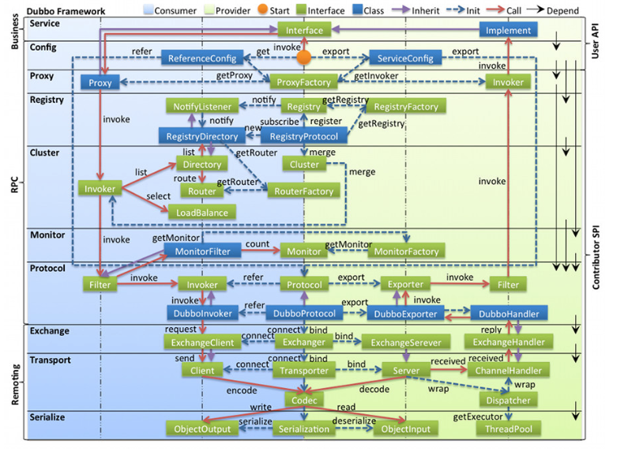

# Dubbo层级模型

- **config 配置层**：对外配置接口，以 `ServiceConfig`, `ReferenceConfig` 为中心，可以直接初始化配置类，也可以通过 spring **解析配置生成配置类**

- Cluster 是外围概念，所以 Cluster 的目的是将多个 Invoker 伪装成一个 Invoker，这样其它人只要关注 Protocol 层 Invoker 即可，加上 Cluster 或者去掉 Cluster 对其它层都不会造成影响，因为只有一个提供者时，是不需要 Cluster 的。

在RPC中，Protocol是核心层，也就是只要有Protocol + Invoker + Exporter就可以完成非透明的RPC调用，然后在Invoker的主过程上Filter拦截点。

Remoting实现是Dubbo协议的实现，如果你选择RMI协议，整个Remoting都不会用上，Remoting内部再划为Transport传输层和Exchange信息交换层，Transport层只负责单向消息传输，是对Mina、Netty、Grizzly的抽象，它也可以扩展UDP传输，而Exchange层是在传输层之上封装了Request-Response语义。

Registry和Monitor实际上不算一层，而是一个独立的节点，只是为了全局概览，用层的方式画在一起。