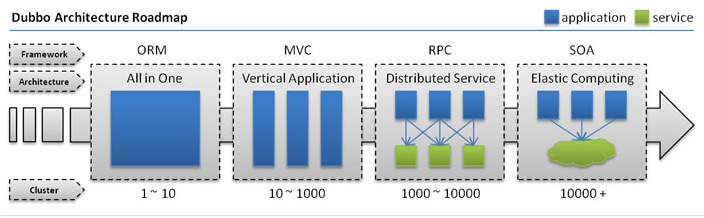
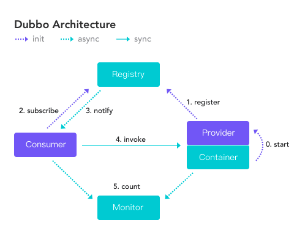

# Summary

## 架构演变

### 单体应用架构

JEE

MVC

### 分布式应用架构

应用垂直拆分后，业务上的跨应用交互不可避免，此时就需要一种能够远程调用其他应用中的方法的手段。

在不考虑 RPC 之前，我们可以自己设想怎样才能在一个应用中调用另一个应用中的某个方法。

- 首先需要解决的就是网络传输，也就是**通信问题**，很明显，这两个应用之间肯定需要建立某种连接来进行通信交互。
- 好了，我们假设两个应用已经能够互相交互了，但是我们怎么知道要调用哪个方法呢？在本地的时候，我们可以很容易的调用某个对象的某个方法，但是远程的应用就不行了，因为这两个应用，具体来说是这两个进程的地址空间是完全不同的。所以此时需要解决的问题是**寻址问题**，也就是找到具体是调用哪个主机的哪个端口的哪个方法。
- 好了，我们可以找到这个方法了，但是不可能每次都调用空参数的方法啊。如果方法需要传参，怎么办？我们的参数需要经过网络传输，所以必须是二进制数据，而参数是在内存中的，因此我们需要将内存中的**参数序列化**成二进制的形式。
- 远程应用收到方法的调用请求，并拿到了我们传输的参数，此时还需要将**参数反序列化**成内存的表示形式传入方法中执行，执行结束后将结果返回。返回的结果同样需要序列化传输，本地应用接收到返回的数据后再反序列化成内存中的表示方式。

解决了以上的问题，也就解决了远程方法调用的问题，解决这些问题的实现被称为 RPC（远程过程调用）。

PRC 有早期的 CORBA、Java RMI，还有基于 XML 的 XML-PRC、Web Service、SOAP，基于 JSON 的 JSON-RPC，以及 Hessian、Thrift、GRPC、hprose 等等。

### 面向服务的架构SOA和微服务架构MSA

https://juejin.im/post/5a5ee63d518825732914748c

讲的还可以
https://baijiahao.baidu.com/s?id=1612574809664801766&wfr=spider&for=pc

### 流动计算应用架构

当服务越来越多，容量的评估、小服务资源的浪费、交互的越发复杂成为新的问题，此时需要增加一个调度中心基于访问压力进行实时的集群资源调度和服务治理。

[架构演变](https://blog.nekolr.com/2018/05/07/%E5%AD%A6%E4%B9%A0%20Dubbo%20%E4%B9%8B%E5%89%8D%EF%BC%9A%E5%BA%94%E7%94%A8%E6%9E%B6%E6%9E%84%E6%BC%94%E5%8F%98/)

## dubbo架构

### 简单架构

[dubbo架构](https://crazyfzw.github.io/2018/06/10/dubbo-architecture/)

