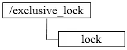
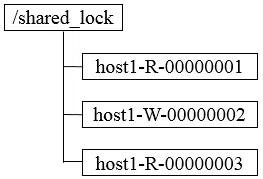

## Lock

### 独占锁

排它锁又称为写锁或独占锁，若事务T1对数据对象O1加上了排它锁，那么在整个加锁期间，只允许事务T1对O1进行读取和更新操作，其他任何事务都不能再对这个数据对象进行任何类型的操作，直到T1释放了排它锁。

### 共享锁

共享锁又称为读锁，若事务T1对数据对象O1加上共享锁，那么当前事务只能对O1进行读取操作，其他事务也只能对这个数据对象加共享锁，直到该数据对象上的所有共享锁都被释放。

https://juejin.im/post/5b03d58a6fb9a07a9e4d8f01