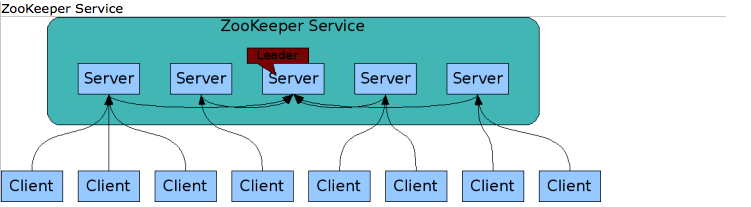
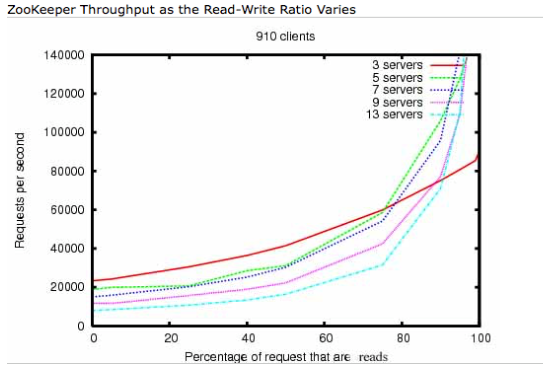

## 分布式协调服务-Zookeeper   

### 主要特点

1.Zookeeper的主要作用是为分布式系统提供协调服务,包括但不限于:分布式锁,统一命名服务,配置管理,负载均衡,主控服务器选举以及主从切换等。

2.Zookeeper自身通常也以分布式形式存在。一个Zookeeper服务通常由多台服务器节点构成,只要其中超过一半的节点存活,Zookeeper即可正常对外提供服务,所以Zookeeper也暗含高可用的特性。客户端可以通过TCP协议连接至任意一个服务端节点请求Zookeeper集群提供服务,而集群内部如何通信以及如何保持分布式数据一致性等细节对客户端透明。如下图所示

3.Zookeeper是以高吞吐量为目标进行设计的,故而在读多写少的场合有非常好的性能表现。如下图所示

高吞吐特性的原因：

1.Zookeeper集群的任意一个服务端节点都可以直接响应客户端的读请求(写请求会不一样些,下面会详谈),并且可以通过增加节点进行横向扩展。这是其吞吐量高的主要原因

2.Zookeeper将全量数据存储于内存中,从内存中读取数据不需要进行磁盘IO,速度要快得多。这一点有点像redis

3.Zookeeper放松了对分布式数据的强一致性要求,即不保证数据实时一致,允许分布式数据经过一个时间窗口达到最终一致,这也在一定程度上提高了其吞吐量。
强一致性，要求在全局同一时间线的情况下，在修改时间点之后，所有节点数据完全一致。

增加服务器节点可以提高读的性能，但是会影响写的性能，因为同步成本增大了

### ZooKeeper集群角色

- Leader 

  首脑，通过集群选举产生，统一处理集群事务性请求和调度

- Follower
  
  Follower的主要职责有以下几点:
  1.参与Leader选举投票
  2.参与事务请求Proposal的投票
  3.处理客户端非事务请求(读),并转发事务请求(写)给Leader服务器
  
  
- Observer

  Observer是弱化版的Follower。其像Follower一样能够处理非事务也就是读请求,并转发事务请求给Leader服务器,但是其不参与任何形式的投票,不管是Leader选举投票还是事务请求Proposal的投票。引入这个角色主要是为了在不影响集群事务处理能力的前提下提升集群的非事务处理的吞吐量。

一致性:ZAB协议

原子性:

单一视图:客户端连接集群任意zk节点，能得到的数据是一致的

可靠性:每次对zk的操作状态都保存在服务端

实时性:客户端可以读取到服务端的最新数据

### 安装包目录

bin
 
conf zk.cfg

contrib

dist-maven

lib 依赖的jar包

recipes 样例demo {election lock queue}

