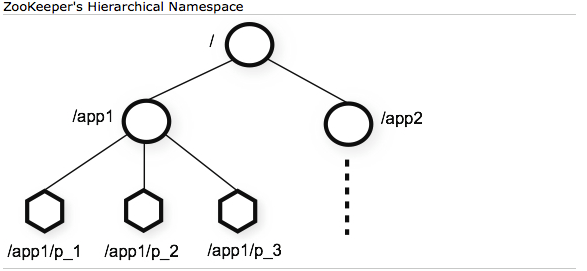

## zookeeper-data-structure

### znode

树

临时节点(客户端断开连接后丢失) 也可以有顺序节点

永久节点

- 普通持久节点 

- 持久顺序节点

  在具有持久结点基本特性的基础上,会通过在结点路径后缀一串序号来区分多个子结点创建的先后顺序。这工作由Zookeeper服务端自动给我们做,只要在创建Znode时指定结点类型为该类型。

znode带有版本号，每次节点数据发生变化，节点版本好会累加，用于实现乐观锁。

版本号不匹配，在执行删除等操作的时候会报错。

每个zk节点存储的数据不适合太大 一般几k

权限acl

选举模式(首脑模式) 

主节点挂了之后，从节点会选出一个主节点。

统一配置文件管理

发布于订阅 类似mq

分布式锁

集群管理 集群中保证数据强一致性

