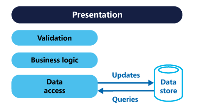
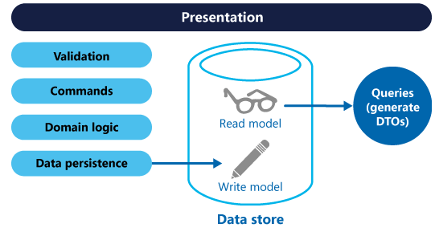
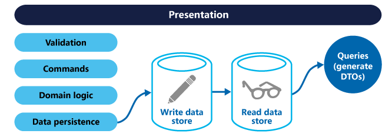

## CQRS模式

> 命令查询的责任分离 Command Query Responsibility Segregation

### 介绍

在常用的三层架构中，通常都是通过数据访问层来修改或者查询数据，一般修改和查询使用的是相同的实体。在一些业务逻辑简单的系统中可能没有什么问题，但是随着系统逻辑变得复杂，用户增多，这种设计就会出现一些性能问题。虽然在DB上可以做一些读写分离的设计，但在业务上如果在读写方面混合在一起的话，仍然会出现一些问题。

命令查询职责分离模式(Command Query Responsibility Segregation，CQRS)，**该模式从业务上分离修改 (Command，增，删，改，会对系统状态进行修改)和查询（Query，查，不会对系统状态进行修改)的行为。从而使得逻辑更加清晰，便于对不同部分进行针对性的优化。**


### 传统CURD

#### 介绍

在以前的管理系统中，命令(Command，通常用来更新数据，操作DB)和查询(Query)通常使用的是在数据访问层中Repository中的实体对象(这些对象是对DB中表的映射)，这些实体有可能是SQLServer中的一行数据或者多个表。

通常对DB执行的增，删，改，查（CRUD）都是针对的系统的实体对象。如通过数据访问层获取数据，然后通过数据传输对象DTO传给表现层。或者，用户需要更新数据，通过DTO对象将数据传给Model，然后通过数据访问层写回数据库，系统中的所有交互都是和数据查询和存储有关，可以认为是数据驱动（[Data-Driven](http://en.wikipedia.org/wiki/Data-driven_programming)）的，如下图：



对于一些比较简单的系统，使用这种CRUD的设计方式能够满足要求。特别是通过一些代码生成工具及ORM等能够非常方便快速的实现功能。

#### 问题

- 使用同一个对象实体来进行数据库读写可能会太粗糙，大多数情况下，比如编辑的时候可能只需要更新个别字段，但是却需要将整个对象都穿进去，有些字段其实是不需要更新的。在查询的时候在表现层可能只需要个别字段，但是需要查询和返回整个实体对象。
- 使用同一实体对象对同一数据进行读写操作的时候，可能会遇到资源竞争的情况，经常要处理的锁的问题，在写入数据的时候，需要加锁。读取数据的时候需要判断是否允许脏读。这样使得系统的逻辑性和复杂性增加，并且会对系统吞吐量的增长会产生影响。
- 直接与数据库进行交互在大数据量同时访问的情况下可能会影响性能和响应性，并且可能会产生性能瓶颈。
- 由于同一实体对象都会在读写操作中用到，所以对于安全和权限的管理会变得比较复杂。

这里面很重要的一个问题是，**系统中的读写频率比**，是偏向读，还是偏向写，就如同一般的**数据结构在查找和修改上时间复杂度**不一样，在设计系统的结构时也需要考虑这样的问题。解决方法就是我们经常用到的对数据库进行读写分离。 让主数据库处理事务性的增，删，改操作(Insert,Update,Delete)操作，让从数据库处理查询操作(Select操作)，数据库复制被用来将事务性操作导致的变更同步到集群中的从数据库。这只是从DB角度处理了读写分离，但是从业务或者系统上面读和写仍然是存放在一起的。他们都是用的同一个实体对象。

从业务上将读和写分离，就是命令查询职责分离模式。

### CQRS

CQRS最早来自于Betrand Meyer（Eiffel语言之父，[开-闭原则](http://msdn.microsoft.com/en-us/magazine/cc546578.aspx)OCP提出者）在 [Object-Oriented Software Construction](http://www.amazon.com/gp/product/0136291554) 这本书中提到的一种 [命令查询分离](http://martinfowler.com/bliki/CommandQuerySeparation.html)([Command Query Separation](http://en.wikipedia.org/wiki/Command-query_separation),CQS) 的概念。其基本思想在于，任何一个对象的方法可以分为两大类：

- 命令(Command):不返回任何结果(void)，但会改变对象的状态。
- 查询(Query):返回结果，但是不会改变对象的状态，对系统没有副作用。

根据CQS的思想，任何一个方法都可以拆分为命令和查询两部分，比如：

```java
private int i = 0;
private int Increase(int value)
{
    i += value;
    return i;
}

```

这个方法，我们执行了一个命令即对变量i进行相加，同时又执行了一个Query，即查询返回了i的值，如果按照CQS的思想，该方法可以拆成Command和Query两个方法，如下：

```java
private void IncreaseCommand(int value)
{
    i += value;
}
private int QueryValue()
{
    return i;
}
```

操作和查询分离使得我们能够更好的把握对象的细节，能够更好的理解哪些操作会改变系统的状态。当然[CQS](http://en.wikipedia.org/wiki/Command-query_separation)也有一些缺点，比如代码需要处理多线程的情况。

CQRS是对CQS模式的进一步改进成的一种简单模式。 它由Greg Young在[CQRS, Task Based UIs, Event Sourcing agh!](http://codebetter.com/gregyoung/2010/02/16/cqrs-task-based-uis-event-sourcing-agh/) 这篇文章中提出。“CQRS只是简单的将之前只需要创建一个对象拆分成了两个对象，这种分离是基于方法是执行命令还是执行查询这一原则来定的(这个和CQS的定义一致)”。

CQRS使用分离的接口将数据查询操作(Queries)和数据修改操作(Commands)分离开来，这也意味着在查询和更新过程中使用的数据模型也是不一样的。这样读和写逻辑就隔离开来了。



使用CQRS分离了读写职责之后，可以对数据进行读写分离操作来改进性能，可扩展性和安全。如下图：




### 何时使用CQRS


### 参考

https://www.cnblogs.com/yangecnu/p/Introduction-CQRS.html


infoQ https://www.infoq.cn/article/from-cqs-to-cqrs