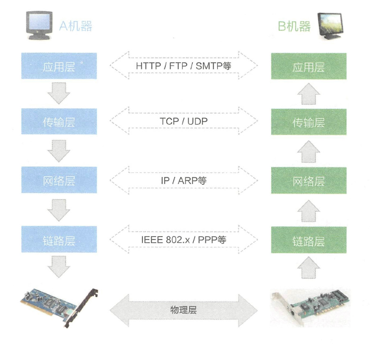
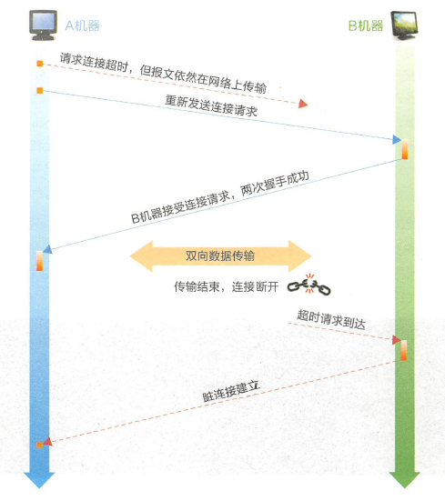
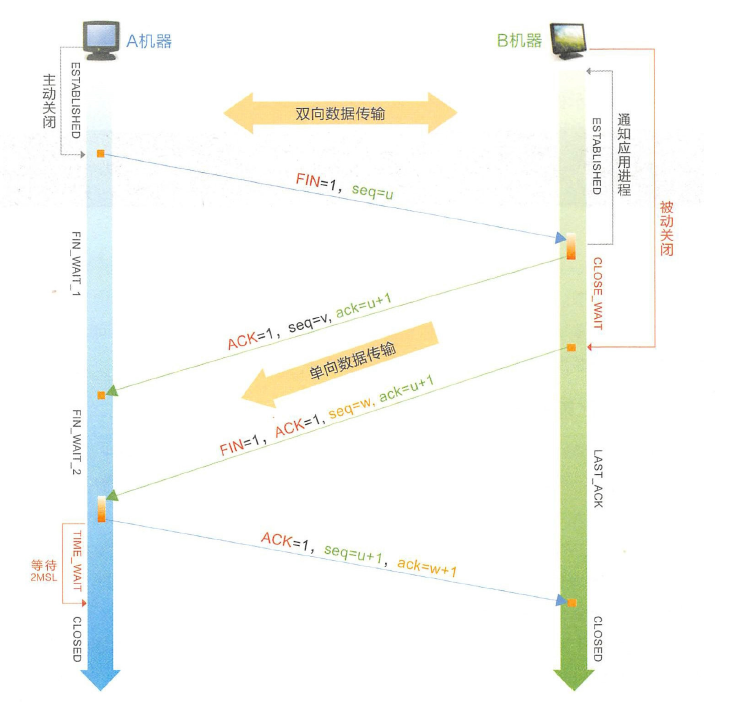

## TCP

程序在发送消息时，应用层接既定的协议打包数据， 随后由传输层加上双方的端口号，由网络层加上双方的IP 地址，由链路层加上双方的MAC 地址， 并将数据拆分成数据帧， 经过多个路由器和网关后， 到达目标机器。简而言之， 就是按“ 端口→ IP 地址→ MAC 地址” 这样的路径进行数据的封装和发送， 解包的时候反过来操作即可。

### 三次握手

  A ----SYN=1,seq=x------------------------------> B // 成功 B确认:B机器收，A机器发    
  A <---SYN=1,seq=y,ACK=1,ack=x+1---------- B // 成功 A确认:A机器发，A机器收，B机器收，B机器发   
  A ----seq=x+1,ACK=1,ack=y+1---------------> B // 成功 B确认:A机器收，B机器发

#### 为什么不是两次握手？  
防止脏连接

  

而如果是三次握手， 贝lj B 机器收到连接请求后，同样会向A 机器确认同意创建连接，
 但因为A 机器不是SYN SENT 状态，所以会直接丢弃， B 机器由于长时间没有收到
 确认信息， 最终超时导致连接创建失败，因而不会出现脏连接。

### 四次挥手

#### 为什么需要time_wait?
对B机器负责，如果B机器没有收到最后一次ACK，B机器会重发FIN+ACK。这样可以确保B机器进入closed状态   
并且防止己失效连接的请求数据包与正常连接的请求数据包混淆而发生异常。

