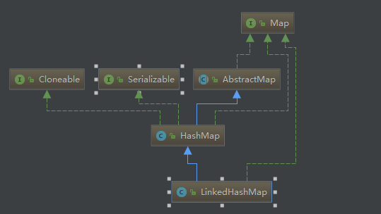

## LinkedHashMap 源码阅读





```` java
public class LinkedHashMap<K,V>
    extends HashMap<K,V>
    implements Map<K,V>
````


```
    /**
     * The head of the doubly linked list.
     */
    transient Entry<K,V> header;  // 双向链表的表头元素
    
    /**
     * The tail (youngest) of the doubly linked list.
     */
    transient LinkedHashMap.Entry<K,V> tail;

    /**
     * The iteration ordering method for this linked hash map: <tt>true</tt>
     * for access-order, <tt>false</tt> for insertion-order.
     *
     * @serial
     */
    final boolean accessOrder;  //true表示按照访问顺序迭代，false时表示按照插入顺序 

```


参考
https://yikun.github.io/2015/04/02/Java-LinkedHashMap%E5%B7%A5%E4%BD%9C%E5%8E%9F%E7%90%86%E5%8F%8A%E5%AE%9E%E7%8E%B0/
https://blog.csdn.net/justloveyou_/article/details/71713781