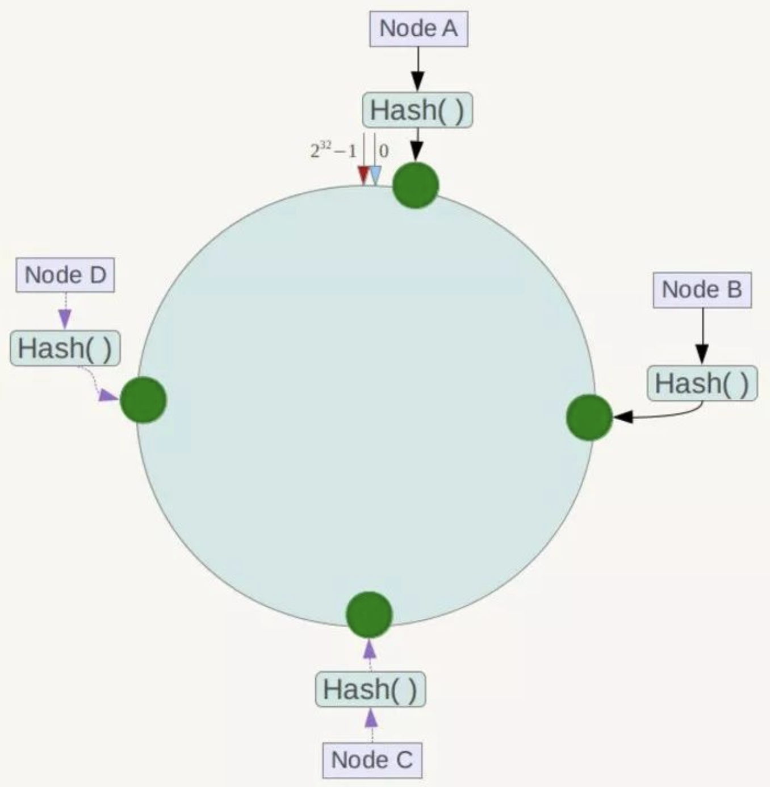
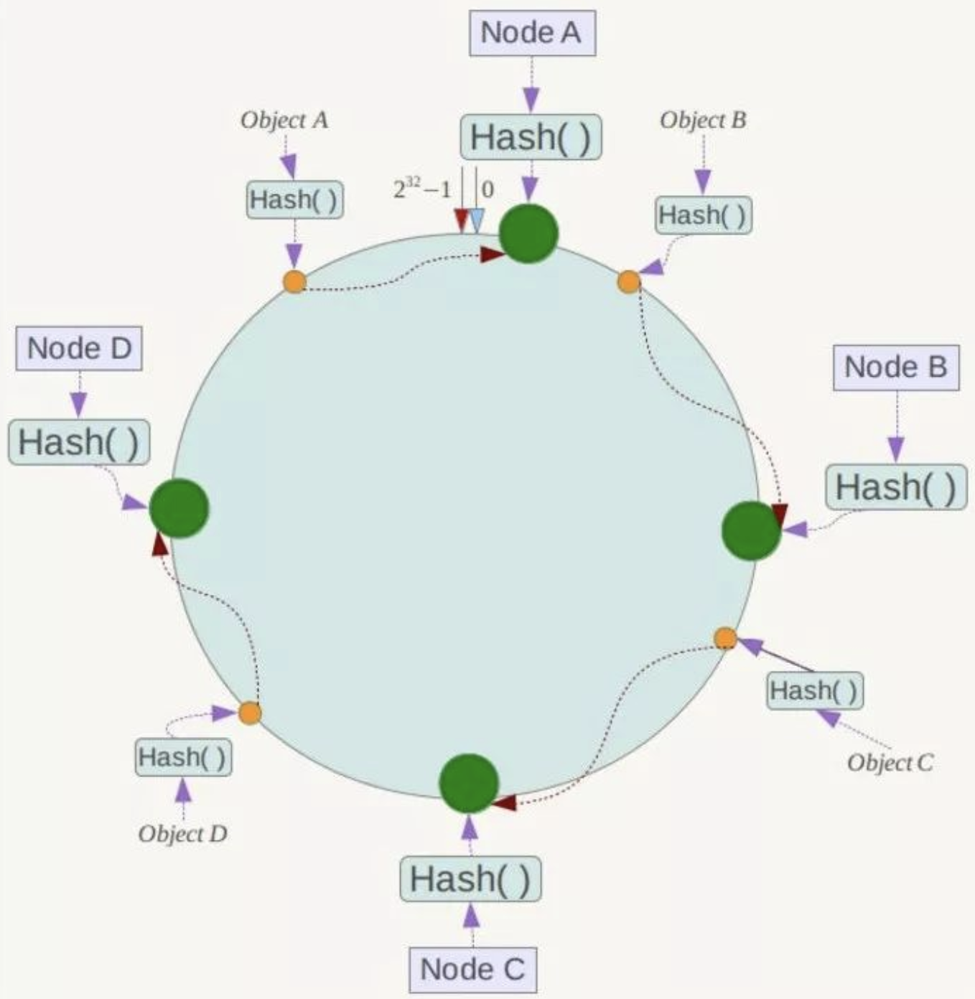
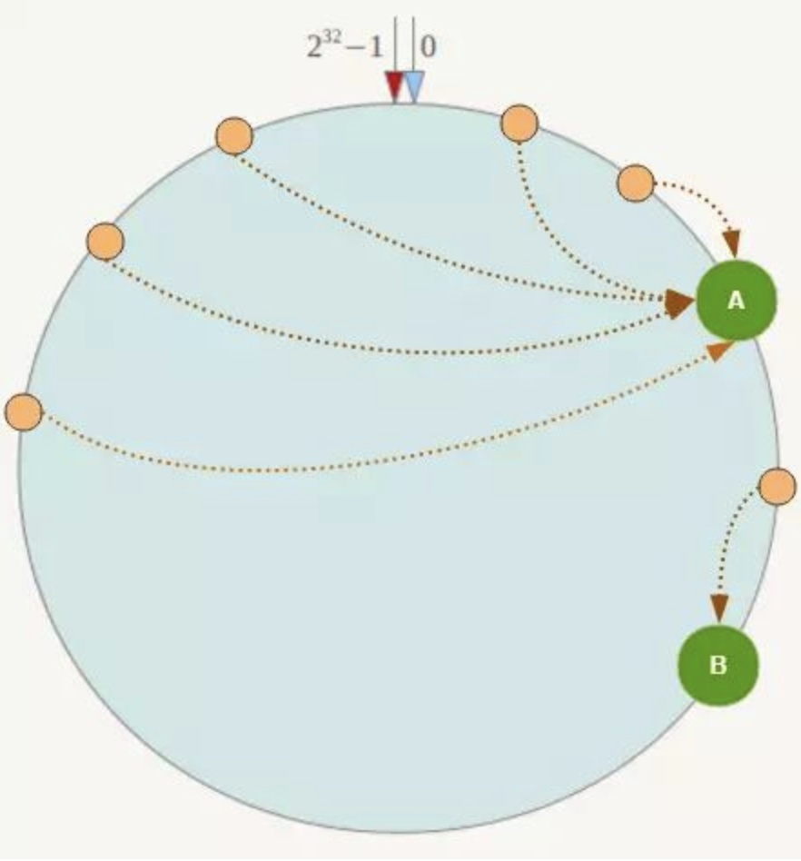

# 一致性Hash

## 解决什么问题?

分布式缓存,使用余数hash,服务器数目变动时,所有缓存的位置都要改变,需要rehash.这会造成缓存在一定时间内是失效的，当应用无法从缓存中获取数据时，则会向后端数据库请求数据.(缓存雪崩).

分布式系统每个节点都有可能失效，并且新的节点很可能动态的增加进来，如何保证当系统的节点数目发生变化的时候，我们的系统仍然能够对外提供良好的服务，

## 算法思路

一致性Hash算法将整个哈希值空间组织成一个虚拟的圆环，如假设某哈希函数H的值空间为0-2^32-1.

将数据key使用相同的函数Hash计算出哈希值，并确定此数据在环上的位置，从此位置沿环顺时针“行走”，第一台遇到的服务器就是其应该定位到的服务器.

一致性Hash算法对于节点的增减都只需重定位环空间中的一小部分数据，具有较好的容错性和可扩展性。

## Hash环的数据倾斜问题

在服务节点数量较少的时候.可能出现数据分配不均的问题,这时可以引入虚拟节点.

增加一层虚拟节点到实际节点的映射,这样就解决了服务节点少时数据倾斜的问题。

在实际应用中，通常将虚拟节点数设置为32甚至更大，因此即使很少的服务节点也能做到相对均匀的数据分布。

## 参考

https://juejin.im/post/5ae1476ef265da0b8d419ef2

https://zhuanlan.zhihu.com/p/34985026